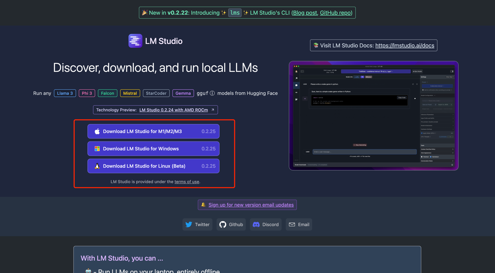
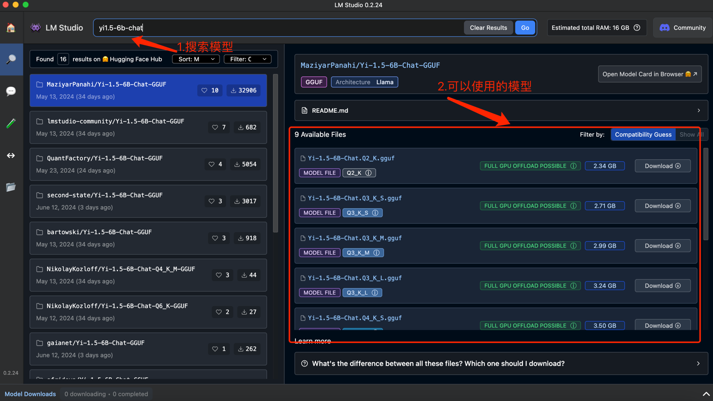

### 🌟使用LM Studio本地运行

LM Studio 是一款易于使用的桌面应用程序，用于试用本地和开源的大型语言模型 (LLM)，能更好的在本地部署大模型，并且操作相对简单。

#### 下载和安装

LM Studio的安装非常简单，只需要前往LM Studio的[官方网站](https://lmstudio.ai/)。

按照自己的电脑操作系统进行安装即可

等待下载好后打开LM Studio软件，在搜索框搜索yi1.5-6b-chat或其它模型，以下示例使用yi1.5-6b-chat

LM Studio会友好的帮你评估本地电脑可以运行哪些模型，这可以很好的避免，显存问题

同样的选择你想要本地运行的模型，然后点击download下载就可以进行使用了。
