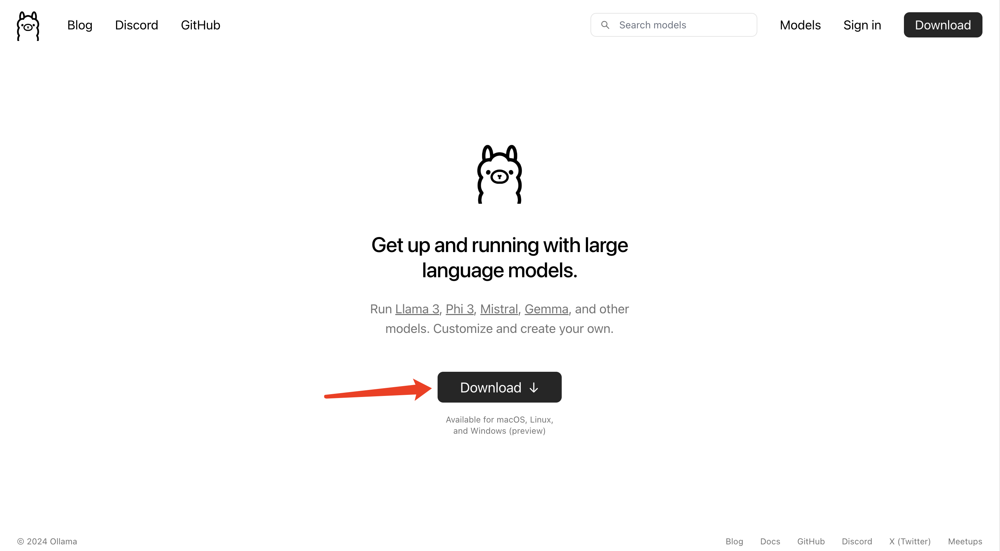
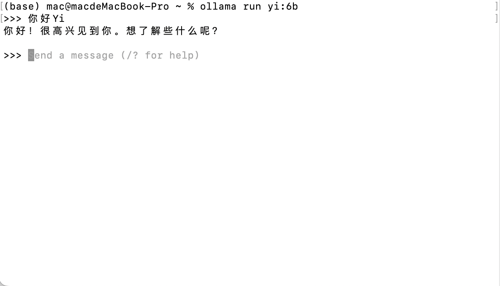
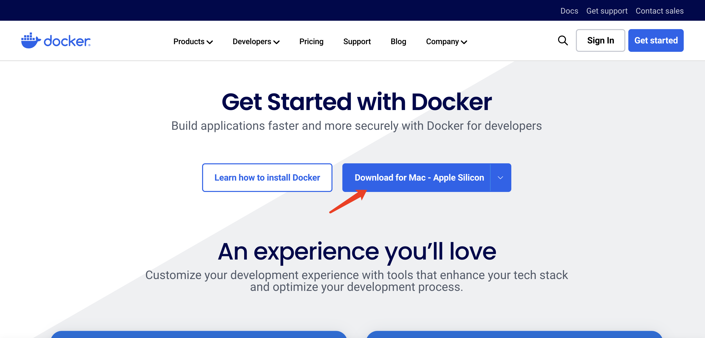
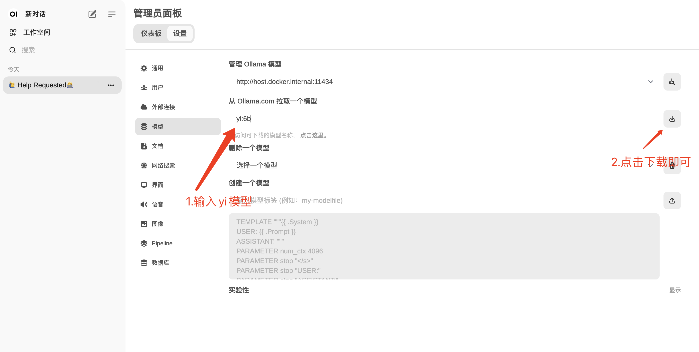
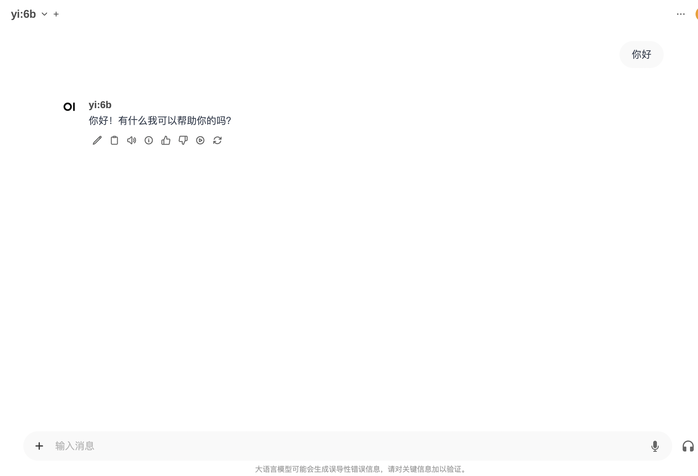

### 🌟使用ollama本地运行

ollama是一个开源的大型语言模型服务工具，它允许用户在自己的硬件环境中轻松部署和使用大规模预训练模型。使得用户能够快速地在本地运行这些模型。

#### 下载和安装

可以直接在ollama[官方网站](https://ollama.com/)进行下载,点击download，选择自己电脑对应的版本进行下载。

	


下载后按照对应的流程安装即可。

#### 本地使用

1.终端运行

你可以选择直接在终端中进行运行yi系列模型，官方可选择的模型具体参考[文档](https://ollama.com/library/yi)。

``````bash
ollama run yi:6b
``````

- 运行命令后ollama会自动下载模型到本地
- 下载完成后即可进行使用

下图为运行成功参考示意图：



2.使用[OpenWebUI](https://openwebui.com/)运行

使用OpenWebUI运行的好处是，能够可视化的进行更多的操作，基本不需要使用命令进行操作，使用体验非常好，操作门槛低。

接下来我们开始进行安装操作：

- 第一步首先确保你已经正确的安装好了ollama

- 第二步安装docker

​	Docker是一种轻量级的虚拟化技术，同时是一个开源的应用容器运行环境搭建平台，可以让开发者以便捷方	式打包应用到一个可移植的容器中，然后安装至任何运行Linux或Windows等系统的服务器上。相较于传统虚	拟机，Docker容器提供轻量化的虚拟化方式、安装便捷、启停速度快。

​	简单来说就是通过docker来运行OpenWebUI。

​	安装也很简单只需要前往docker[官网](https://www.docker.com/get-started/),根据电脑型号，点击Download进行下载。



- 第三步在终端运行如下指令,等待安装即可

  ``````bash
  docker run -d -p 3000:8080 --add-host=host.docker.internal:host-gateway -v open-webui:/app/backend/data --name open-webui --restart always ghcr.io/open-webui/open-webui:main
  ``````

- 第四步再次启动docker，打开OpenWebUI

- 第五步下载模型

  

下载完成后就可以在对话中进行使用了

