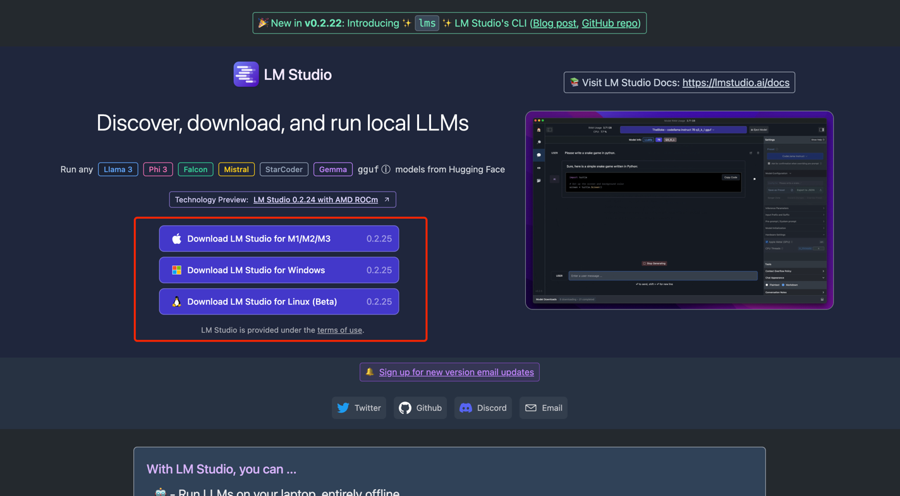

### 🌟Local Running with LM Studio

LM Studio is an easy-to-use desktop application for experimenting with local and open-source large language models (LLMs), enabling better local deployment of large models with relatively simple operations.

#### Download and Installation

Installing LM Studio is very simple. Just visit the LM Studio [official website](https://lmstudio.ai/).

Install the version according to your computer's operating system.

After downloading, open the LM Studio software and search for "yi1.5-6b-chat" or other models in the search bar. The following example uses "yi1.5-6b-chat".

LM Studio will helpfully assess which models your local computer can run, which can effectively avoid memory issues.

Similarly, select the model you want to run locally and click "download" to start using it.
