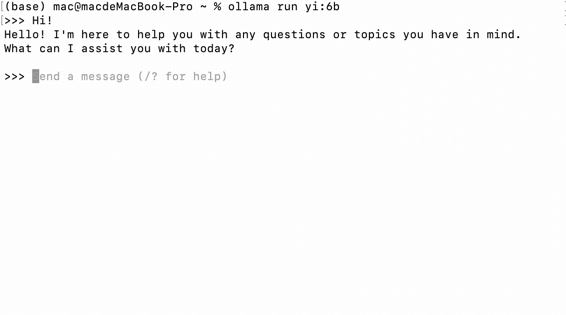

### 🌟Local Running with ollama

ollama is an open-source large language model serving tool that allows users to easily deploy and use large pre-trained models in their own hardware environments. This enables users to quickly run these models locally.

#### Download and Installation

You can directly download it from the ollama [official website](https://ollama.com/). Click on "download" and choose the version that matches your computer system.


After downloading, install it according to the corresponding process.

#### Local Usage

There are two ways to use it locally.

1. **Terminal Execution**

You can choose to run the Yi series models directly in the terminal. For the officially available models, please refer to the [documentation](https://ollama.com/library/yi).

``````bash
ollama run yi:6b
``````

- After running the command, ollama will automatically download the model to your local machine.
- Once the download is complete, you can start using it.

The following image shows an example of a successful run:



2. **Running with [OpenWebUI](https://openwebui.com/)**

The advantage of using OpenWebUI is that it allows for more visual operations, basically eliminating the need for command-line operations. It provides a very good user experience and has a low barrier to entry.

Let's proceed with the installation:

- **Step 1:** Ensure you have correctly installed ollama.

- **Step 2:** Install Docker.

​	Docker is a lightweight virtualization technology and an open-source platform for building application container runtime environments. It allows developers to easily package applications into a portable container that can be installed on any server running Linux or Windows. Compared to traditional virtual machines, Docker containers offer a lightweight virtualization approach, easy installation, and fast startup and shutdown speeds.

​	Simply put, we will use Docker to run OpenWebUI.

​	Installation is easy. Just go to the Docker [official website](https://www.docker.com/get-started/) and click on "Download" according to your computer model.


- **Step 3:** Run the following command in the terminal and wait for the installation to complete:

  ``````bash
  docker run -d -p 3000:8080 --add-host=host.docker.internal:host-gateway -v open-webui:/app/backend/data --name open-webui --restart always ghcr.io/open-webui/open-webui:main
  ``````

- **Step 4:** Start Docker again and open OpenWebUI.

- **Step 5:** Download the model.


Once the download is complete, you can start using it in the conversation interface.

