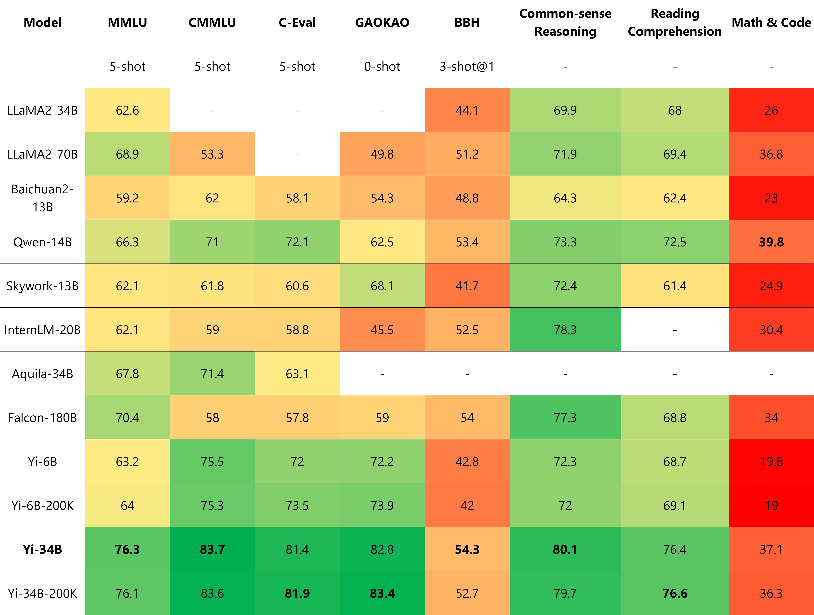
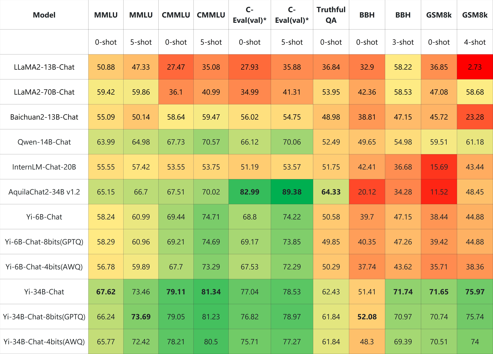
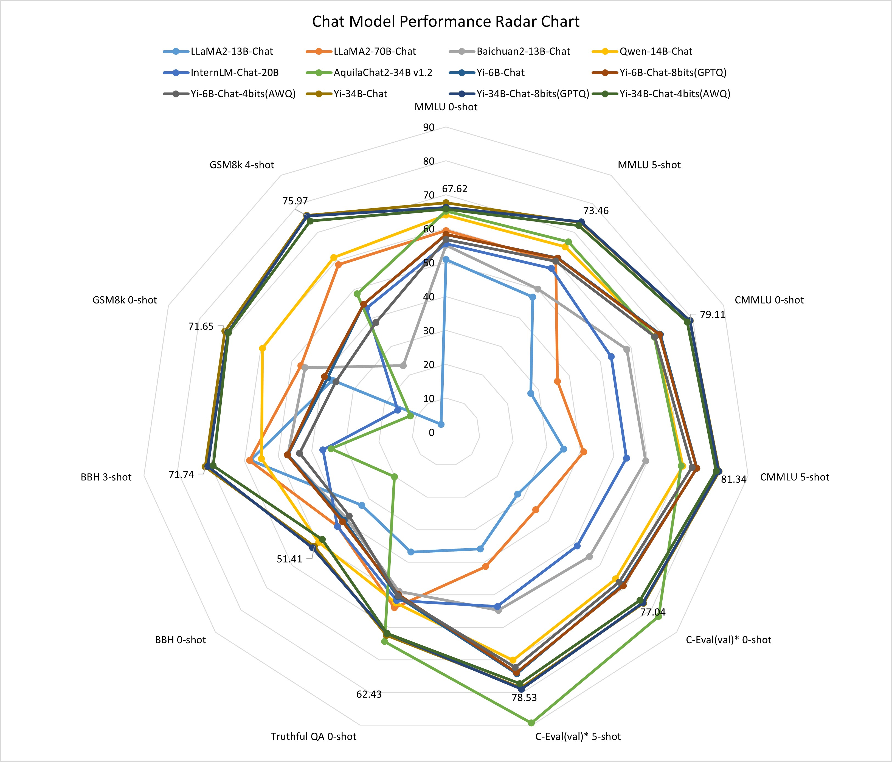
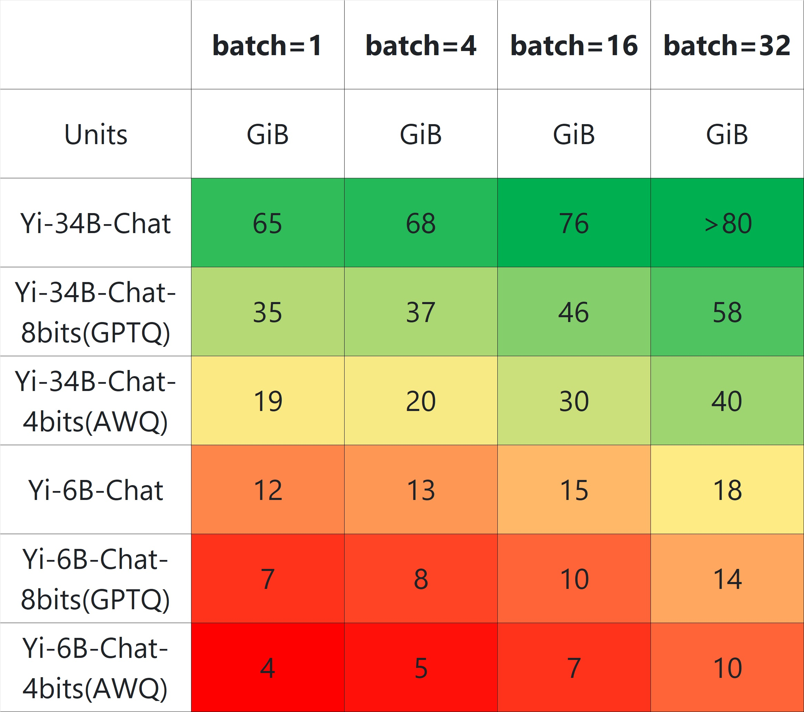
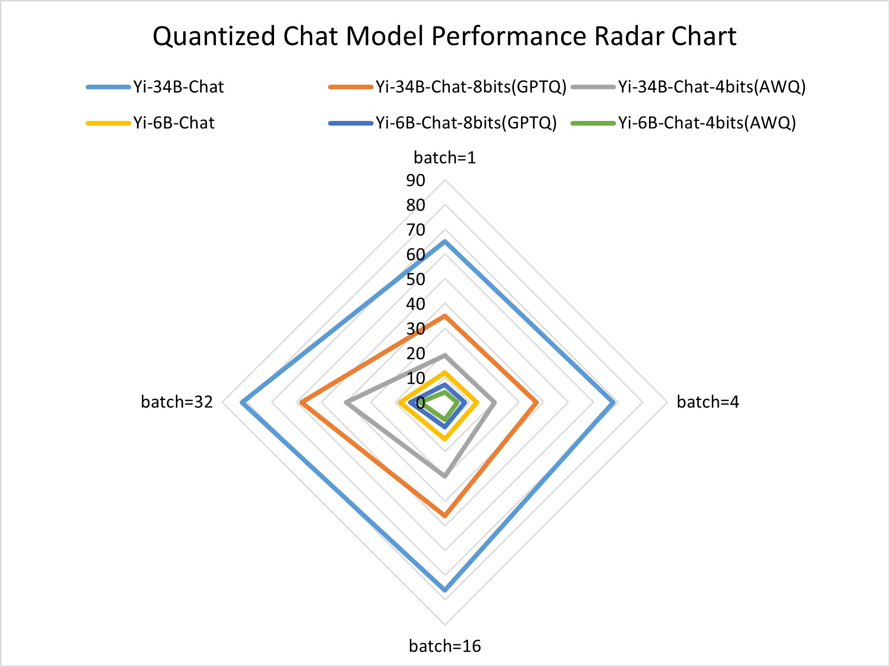

<div align="center">

<picture>
  <source media="(prefers-color-scheme: dark)" srcset="https://raw.githubusercontent.com/01-ai/Yi/main/assets/img/Yi_logo_icon_dark.svg" width="200px">
  <source media="(prefers-color-scheme: light)" srcset="https://raw.githubusercontent.com/01-ai/Yi/main/assets/img/Yi_logo_icon_light.svg" width="200px"> 
  
</picture>

</br>
</br>

<a href="https://github.com/01-ai/Yi/actions/workflows/build_docker_image.yml">
  
</a>
<a href="https://github.com/01-ai/Yi/blob/main/LICENSE">
  
</a>
<a href="https://github.com/01-ai/Yi/blob/main/MODEL_LICENSE_AGREEMENT.txt">
  
</a>
<a href="mailto:oss@01.ai">
  
</a>

</div>

<div align="center">
  <h3 align="center">Building the Next Generation of Open-Source and Bilingual LLMs</h3>
</div>

<p align="center">
🤗 <a href="https://huggingface.co/01-ai" target="_blank">Hugging Face</a> • 🤖 <a href="https://www.modelscope.cn/organization/01ai/" target="_blank">ModelScope</a> • ✡️ <a href="https://wisemodel.cn/organization/01.AI" target="_blank">WiseModel</a>
</p> 

<p align="center">
    👩‍🚀 Ask questions or discuss ideas on <a href="https://github.com/01-ai/Yi/discussions" target="_blank"> GitHub </a>!
</p> 

<p align="center">
    👋 Join us on 💬 <a href="https://github.com/01-ai/Yi/issues/43#issuecomment-1827285245" target="_blank"> WeChat (Chinese) </a>!
</p> 

<p align="center">
    📚 Grow at <a href="https://github.com/01-ai/Yi/blob/main/docs/learning_hub.md"> Yi Learning Hub </a>!
</p> 


<!-- DO NOT REMOVE ME -->

<hr>

<details open>
<summary></b>📕 Table of Contents</b></summary>

- [🟢 What is Yi?](#-what-is-yi)
  - [📌 Introduction](#-introduction)
  - [🎯 Models](#-models)
    - [Chat models](#chat-models)
    - [Base models](#base-models)
    - [Other info](#other-info)
  - [🎉 News](#-news)
- [🟢 Why Yi?](#-why-yi)
  - [🌎 Ecosystem](#-ecosystem)
    - [💦 Upstream](#-upstream)
    - [🌊 Downstream](#-downstream)
      - [🔗 Serving](#-serving)
      - [⚙️ Quantitation](#️-quantitation)
      - [🛠️ Fine-tuning](#️-fine-tuning)
  - [📌 Benchmarks](#-benchmarks)
    - [📊 Base model performance](#-base-model-performance)
    - [📊 Chat model performance](#-chat-model-performance)
    - [📊 Quantized chat model performance](#-quantized-chat-model-performance)
    - [⛔️ Limitations of chat model](#️-limitations-of-chat-model)
- [🟢 Who can use Yi?](#-who-can-use-yi)
- [🟢 How to use Yi?](#-how-to-use-yi)
  - [Quick start](#quick-start)
  - [Deployment](https://github.com/01-ai/Yi/blob/main/docs/deployment.md)
  - [Learning hub](https://github.com/01-ai/Yi/blob/main/docs/learning_hub.md)
- [🟢 Misc.](#-misc)
  - [Ackknowledgements](#acknowledgments)
  - [📡 Disclaimer](#-disclaimer)
  - [🪪 License](#-license)

</details>

<hr>

# 🟢 What is Yi?

## 📌 Introduction 

- 🤖 The Yi series models are the next generation of open source large language models trained from scratch by [01.AI](https://01.ai/).

- 🙌 Targeted as a bilingual language model and trained on 3T multilingual corpus, the Yi series models become one of the strongest LLM worldwide, showing promise in language understanding, commonsense reasoning, reading comprehension, and more. For example,

  - For English language capability, the Yi series models ranked 2nd (just behind GPT-4), outperforming other LLMs (such as LLaMA2-chat-70B, Claude 2, and ChatGPT) on the [AlpacaEval Leaderboard](https://tatsu-lab.github.io/alpaca_eval/) in Dec 2023.
  
  - For Chinese language capability, the Yi series models landed in 2nd place (following GPT4), surpassing other LLMs (such as Baidu ERNIE, Qwen, and Baichuan) on the [SuperCLUE](https://www.superclueai.com/) in Oct 2023.

- 🙏 (Credits to LLaMA) Thanks to the Transformer and LLaMA open-source communities, as they reducing the efforts required to build from scratch and enabling the utilization of the same tools within the AI ecosystem. If you're interested in Yi's adoption of LLaMA architecture and license usage policy, see [Yi's relation with LLaMA](https://github.com/01-ai/Yi/blob/main/docs/yi_relation_llama.md).

<div align="right"> [ <a href="#building-the-next-generation-of-open-source-and-bilingual-llms">Back to top ⬆️ </a> ] </div>

## 🎯 Models

Yi models come in multiple sizes and cater to different use cases. You can also fine-tune Yi models to meet your specific requirements. 

### Chat models

| Model | Download  
|---|---
Yi-6B-Chat| • [🤗 Hugging Face](https://huggingface.co/01-ai/Yi-6B-Chat) • [🤖 ModelScope](https://www.modelscope.cn/models/01ai/Yi-6B-Chat/summary)
Yi-6B-Chat-4bits |	• [🤗 Hugging Face](https://huggingface.co/01-ai/Yi-6B-Chat-4bits)  • [🤖 ModelScope](https://www.modelscope.cn/models/01ai/Yi-6B-Chat-4bits/summary)
Yi-6B-Chat-8bits	|  • [🤗 Hugging Face](https://huggingface.co/01-ai/Yi-6B-Chat-8bits) • [🤖 ModelScope](https://www.modelscope.cn/models/01ai/Yi-6B-Chat-8bits/summary)
Yi-34B-Chat	| • [🤗 Hugging Face](https://huggingface.co/01-ai/Yi-34B-Chat)  • [🤖 ModelScope](https://www.modelscope.cn/models/01ai/Yi-34B-Chat/summary)
Yi-34B-Chat-4bits	| • [🤗 Hugging Face](https://huggingface.co/01-ai/Yi-34B-Chat-4bits)  • [🤖 ModelScope](https://www.modelscope.cn/models/01ai/Yi-34B-Chat-4bits/summary)
Yi-34B-Chat-8bits | • [🤗 Hugging Face](https://huggingface.co/01-ai/Yi-34B-Chat-8bits) • [🤖 ModelScope](https://www.modelscope.cn/models/01ai/Yi-34B-Chat-8bits/summary)

<sub><sup> - 4-bit series models are quantized by AWQ. <br> - 8-bit series models are quantized by GPTQ <br> - All quantized models have a low barrier to use since they can be deployed on consumer-grade GPUs (e.g., 3090, 4090).</sup></sub>

### Base models

| Model | Download | 
|---|---|
Yi-6B| • [🤗 Hugging Face](https://huggingface.co/01-ai/Yi-6B)  • [🤖 ModelScope](https://www.modelscope.cn/models/01ai/Yi-6B/summary)
Yi-6B-200K	| • [🤗 Hugging Face](https://huggingface.co/01-ai/Yi-6B-200K) • [🤖 ModelScope](https://www.modelscope.cn/models/01ai/Yi-6B-200K/summary)
Yi-34B| • [🤗 Hugging Face](https://huggingface.co/01-ai/Yi-34B)  • [🤖 ModelScope](https://www.modelscope.cn/models/01ai/Yi-34B/summary)
Yi-34B-200K|• [🤗 Hugging Face](https://huggingface.co/01-ai/Yi-34B-200K)  • [🤖 ModelScope](https://www.modelscope.cn/models/01ai/Yi-34B-200K/summary)

<sub><sup> - 200k is roughly equivalent to 400,000 Chinese characters.  </sup></sub>

### Other info

For chat models and base models:

- 6B series models are suitable for personal and academic use.

- 34B series models suitable for personal, academic, and commercial (particularly for small and medium-sized enterprises) purposes. It's a cost-effective solution that's affordable and equipped with emergent ability.

- The **default context window** is **4k tokens**.
  
- The pretrained tokens are 3T.
  
- The training data are up to June 2023.	

<div align="right"> [ <a href="#building-the-next-generation-of-open-source-and-bilingual-llms">Back to top ⬆️ </a> ] </div>

## 🎉 News 

<details>
<summary>🎯 <b>2023/11/23</b>: The chat models are open to public.</summary>

This release contains two chat models based on previously released base models, two 8-bit models quantized by GPTQ, and two 4-bit models quantized by AWQ.

- `Yi-34B-Chat`
- `Yi-34B-Chat-4bits`
- `Yi-34B-Chat-8bits`
- `Yi-6B-Chat`
- `Yi-6B-Chat-4bits`
- `Yi-6B-Chat-8bits`

You can try some of them interactively at:

- [Hugging Face](https://huggingface.co/spaces/01-ai/Yi-34B-Chat)
- [Replicate](https://replicate.com/01-ai)
</details>

<details>
<summary>🔔 <b>2023/11/23</b>: The Yi Series Models Community License Agreement is updated to v2.1.</summary>
</details>

<details> 
<summary>🔥 <b>2023/11/08</b>: Invited test of Yi-34B chat model.</summary>

Application form:

- [English](https://cn.mikecrm.com/l91ODJf)
- [Chinese](https://cn.mikecrm.com/gnEZjiQ)

</details>

<details>
<summary>🎯 <b>2023/11/05</b>: The base model of <code>Yi-6B-200K</code> and <code>Yi-34B-200K</code>.</summary>

This release contains two base models with the same parameter sizes as the previous
release, except that the context window is extended to 200K.

</details>

<details>
<summary>🎯 <b>2023/11/02</b>: The base model of <code>Yi-6B</code> and <code>Yi-34B</code>.</summary>

The first public release contains two bilingual (English/Chinese) base models
with the parameter sizes of 6B and 34B.  Both of them are trained with 4K
sequence length and can be extended to 32K during inference time.

</details>

<div align="right"> [ <a href="#building-the-next-generation-of-open-source-and-bilingual-llms">Back to top ⬆️ </a> ] </div>


# 🟢 Why Yi? 
 
## 🌎 Ecosystem

Yi has a comprehensive ecosystem, offering a range of tools, services, and models to enrich your experiences and maximize productivity.

- [💦 Upstream](#-upstream)
- [🌊 Downstream](#-downstream)
  - [🔗 Serving](#-serving)
  - [⚙️ Quantitation](#️-quantitation)
  - [🛠️ Fine-tuning](#️-fine-tuning)
  - [API](#api)

### 💦 Upstream

The Yi series models follow the same model architecture as LLaMA. By choosing Yi, you can leverage existing tools, libraries, and resources within the LLaMA ecosystem, eliminating the need to create new tools and enhancing development efficiency.

For example, the Yi series models are saved in the format of the LLaMA model. You can directly use `LLaMAForCausalLM` and `LLaMATokenizer` to load the model. For more information, see [Use the chat model](#31-use-the-chat-model).

```python
from transformers import AutoModelForCausalLM, AutoTokenizer

tokenizer = AutoTokenizer.from_pretrained("01-ai/Yi-34b", use_fast=False)

model = AutoModelForCausalLM.from_pretrained("01-ai/Yi-34b", device_map="auto")
```

### 🌊 Downstream

> 💡 Tip
> 
> - Feel free to create a PR and share the fantastic work you've built using the Yi series models.
>
> - To help others quickly understand your work, it is recommended to use the format of `<model-name>: <model-intro> + <model-highlights>`.

#### 🔗 Serving 

If you want to get up with Yi in a few minutes, you can use the following services built upon Yi.

- [Yi-34B-Chat](https://platform.lingyiwanwu.com/) (Yi official beta): you can chat with it. **Note** that currently it's available through a whitelist. Welcome to apply (fill out a form in [English](https://cn.mikecrm.com/l91ODJf) or [Chinese](https://cn.mikecrm.com/gnEZjiQ)) and experience it firsthand!
  
- [Yi-6B-Chat (Replicate)](https://replicate.com/01-ai): you can use this model with more options by setting additional parameters and calling APIs.
  
- [ScaleLLM](https://github.com/vectorch-ai/ScaleLLM#supported-models): you can use this service to run Yi models locally with added flexibility and customization.
  
#### ⚙️ Quantitation

If you have limited computational capabilities, you can use Yi's quantized models as follows. 

These quantized models have reduced precision and but offer increased efficiency, such as faster inference speed and smaller RAM usage.

- [TheBloke/Yi-34B-GPTQ](https://huggingface.co/TheBloke/Yi-34B-GPTQ) 
- [TheBloke/Yi-34B-GGUF](https://huggingface.co/TheBloke/Yi-34B-GGUF)
- [TheBloke/Yi-34B-AWQ](https://huggingface.co/TheBloke/Yi-34B-AWQ)
  
#### 🛠️ Fine-tuning

If you're seeking to explore the diverse capabilities within Yi's thriving family, you can delve into Yi's fine-tuned models as below.

- [TheBloke Models](https://huggingface.co/TheBloke): this site hosts numerous fine-tuned models derived from various LLMs including Yi. 
  
  This is not an exhaustive list for Yi, but to name a few sorted on downloads:
  - [TheBloke/dolphin-2_2-yi-34b-AWQ](https://huggingface.co/TheBloke/dolphin-2_2-yi-34b-AWQ)
  - [TheBloke/Yi-34B-Chat-AWQ](https://huggingface.co/TheBloke/Yi-34B-Chat-AWQ)
  - [TheBloke/Yi-34B-Chat-GPTQ](https://huggingface.co/TheBloke/Yi-34B-Chat-GPTQ)
  
- [SUSTech/SUS-Chat-34B](https://huggingface.co/SUSTech/SUS-Chat-34B): this model ranked first among all models below 70B and outperformed the twice larger deepseek-llm-67b-chat. You can check the result on the [Open LLM Leaderboard](https://huggingface.co/spaces/HuggingFaceH4/open_llm_leaderboard).
  
- [OrionStarAI/OrionStar-Yi-34B-Chat-Llama](https://huggingface.co/OrionStarAI/OrionStar-Yi-34B-Chat-Llama): this model excelled beyond other models (such as GPT-4, Qwen-14B-Chat, Baichuan2-13B-Chat) in C-Eval and CMMLU evaluations on the [OpenCompass LLM Leaderboard](https://opencompass.org.cn/leaderboard-llm). 
  
- [NousResearch/Nous-Capybara-34B](https://huggingface.co/NousResearch/Nous-Capybara-34B): this model is trained with 200K context length and 3 epochs on the Capybara dataset. 

#### API

- [amazing-openai-api](https://github.com/soulteary/amazing-openai-api): this tool converts Yi model APIs into the OpenAI API format out of the box.
- [LlamaEdge](https://www.secondstate.io/articles/yi-34b/#create-an-openai-compatible-api-service-for-the-yi-34b-chat-model): this tool builds an OpenAI-compatible API server for Yi-34B-Chat using a portable Wasm (WebAssembly) file, powered by Rust.

<div align="right"> [ <a href="#building-the-next-generation-of-open-source-and-bilingual-llms">Back to top ⬆️ </a> ] </div>

## 📌 Benchmarks 

- [📊 Base model performance](#-base-model-performance)
- [📊 Chat model performance](#-chat-model-performance)
- [📊 Quantized chat model performance](#-quantized-chat-model-performance)
- [⛔️ Limitations of chat model](#️-limitations-of-chat-model)

### 📊 Base model performance


**Color Legend:**
- Green: Represents high values.
- Yellow: Indicates values somewhat lower than the highest.
- Red: Represents low values.

**Evaluation Methods and Findings**

- **Disparity in Results**: While benchmarking open-source models, a disparity has been noted between results from our pipeline and those reported by public sources like OpenCompass.
- **Investigation Findings**: A deeper investigation reveals that variations in prompts, post-processing strategies, and sampling techniques across models may lead to significant outcome differences.
- **Consistency**: Our methodology aligns with the original benchmarks—consistent prompts and post-processing strategies are used, and greedy decoding is applied during evaluations without any post-processing for the generated content.
- **Efforts to Retrieve Unreported Scores**: For scores that were not reported by the original authors (including scores reported with different settings), we try to get results with our pipeline.
- **Extensive Model Evaluation**: To evaluate the model’s capability extensively, we adopted the methodology outlined in Llama2. Specifically, we included PIQA, SIQA, HellaSwag, WinoGrande, ARC, OBQA, and CSQA to assess common sense reasoning. SquAD, QuAC, and BoolQ were incorporated to evaluate reading comprehension.
- **Special Configurations**: CSQA was exclusively tested using a 7-shot setup, while all other tests were conducted with a 0-shot configuration. Additionally, we introduced GSM8K (8-shot@1), MATH (4-shot@1), HumanEval (0-shot@1), and MBPP (3-shot@1) under the category "Math & Code".
- **Falcon-180B Caveat**: Falcon-180B was not tested on QuAC and OBQA due to technical constraints. Its performance score is an average from other tasks, and considering the generally lower scores of these two tasks, Falcon-180B's capabilities are likely not underestimated.

**Comprehensive Performance Evaluation of Yi-34B in Global Model Benchmarks**

- **Overall Performance in Global Benchmarks**: From a more comprehensive assessment, in global large-scale model evaluations, Yi-34B also performs outstandingly in key benchmark sets like "MMLU" (Massive Multitask Language Understanding), BBH, and others that reflect the comprehensive capabilities of models.

- **Yi-34B's Strengths in Diverse Domains**: It excels in MMLU, common-sense reasoning, reading comprehension, and other indicators, aligning highly with Hugging Face's evaluations.

- **Areas of Improvement**: However, like LLaMA2, the Yi series models are slightly behind GPT models in the math and code evaluations of GSM8k and MBPP. Zero-One Infinity's technical approach tends to preserve the model's general capabilities as much as possible during the pre-training phase, hence not incorporating an excessive amount of math and code data.

- **Future Developments and Research**: The research team has previously conducted in-depth explorations in mathematics in works like "Mammoth: Building math generalist models through hybrid instruction tuning". In the future, Zero-One Infinity's series of open-source plans will introduce specialized continued training models for code and mathematical abilities.

### 📊 Chat model performance


**Color Legend:**
- Green: Represents high values.
- Yellow: Indicates values somewhat lower than the highest.
- Red: Represents low values.


**Performance Evaluation**
- **Evaluation Methods**: We evaluated various benchmarks using both zero-shot and few-shot methods, except for TruthfulQA.

- **Zero-Shot vs. Few-Shot**: In chat models, the zero-shot approach is more commonly employed.

- **Evaluation Strategy**: Our evaluation strategy involves generating responses while following instructions explicitly or implicitly (such as using few-shot examples). We then isolate relevant answers from the generated text.

- **Challenges Faced**: Some models are not well-suited to produce output in the specific format required by instructions in few datasets, which leads to suboptimal results.

<strong>*</strong>: C-Eval results are evaluated on the validation datasets

### 📊 Quantized chat model performance

- **Quantized Models Offered**: 
We also provide both 4-bit (AWQ) and 8-bit (GPTQ) quantized Yi chat models.
- **Performance Evaluation**: Evaluation results on various benchmarks have shown that the quantized models have negligible losses.
- **Memory Footprint Reduction**: Additionally, they reduce the memory footprint size.
- **Guidelines for Device Selection**: After testing different configurations of prompts and generation lengths, we highly recommend following the guidelines in the memory footprint table below when selecting a device to run our models.


**Color Legend:**
- Green: Represents high values.
- Yellow: Indicates values somewhat lower than the highest.
- Red: Represents low values.

Note: All the numbers in the table represent the minimum recommended memory for running models of the corresponding size.



### ⛔️ Limitations of chat model

The released chat model has undergone exclusive training using Supervised Fine-Tuning (SFT). Compared to other standard chat models, our model produces more diverse responses, making it suitable for various downstream tasks, such as creative scenarios. Furthermore, this diversity is expected to enhance the likelihood of generating higher quality responses, which will be advantageous for subsequent Reinforcement Learning (RL) training.

However, this higher diversity might amplify certain existing issues, including:

- **Hallucination**: This refers to the model generating factually incorrect or nonsensical information. With the model's responses being more varied, there's a higher chance of hallucination that are not based on accurate data or logical reasoning.
- **Non-determinism in re-generation**: When attempting to regenerate or sample responses, inconsistencies in the outcomes may occur. The increased diversity can lead to varying results even under similar input conditions.
- **Cumulative Error**: This occurs when errors in the model's responses compound over time. As the model generates more diverse responses, the likelihood of small inaccuracies building up into larger errors increases, especially in complex tasks like extended reasoning, mathematical problem-solving, etc.

To achieve more coherent and consistent responses, it is advisable to adjust generation configuration parameters such as`temperature`,`top_p`, or`top_k`. These adjustments can help in the balance between creativity and coherence in the model's outputs.

<div align="right"> [ <a href="#building-the-next-generation-of-open-source-and-bilingual-llms">Back to top ⬆️ </a> ] </div>


# 🟢 Who can use Yi?

Everyone! 🙌 ✅

- The Yi series models are free for personal usage, academic purposes, and commercial use. All usage must adhere to the [Yi Series Models Community License Agreement 2.1](https://github.com/01-ai/Yi/blob/main/MODEL_LICENSE_AGREEMENT.txt)
  
- For free commercial use, you only need to [complete this form](https://www.lingyiwanwu.com/yi-license) to get a Yi Model Commercial License.

<div align="right"> [ <a href="#building-the-next-generation-of-open-source-and-bilingual-llms">Back to top ⬆️ </a> ] </div>

# 🟢 How to use Yi?

- [Quick start](#quick-start)
  
- [Deployment](https://github.com/01-ai/Yi/blob/main/docs/deployment.md)
  
- [Learning hub](https://github.com/01-ai/Yi/blob/main/docs/learning_hub.md)

## Quick start

[1. Prepare development environment](#1-prepare-development-environment)
<br>[2. Download the model](#2-download-the-model-optional)
<br>[3. Examples](#3-examples)

### 1. Prepare development environment

#### 1.1 Docker
The best approach to try the **Yi** series models is through Docker with GPUs. We
provide the following docker images to help you get started.

- `registry.lingyiwanwu.com/ci/01-ai/yi:latest`
- `ghcr.io/01-ai/yi:latest`

Note that the `latest` tag always points to the latest code in the `main`
branch. To test a stable version, please replace it with a specific
[tag](https://github.com/01-ai/Yi/tags).

#### 1.2 Local development environment
We use [`conda-lock`](https://github.com/conda/conda-lock) to generate fully reproducible lock files for conda environments. You can refer to [conda-lock.yml](./conda-lock.yml) for the exact versions of the dependencies. Additionally, we utilize [`micromamba`](https://mamba.readthedocs.io/en/latest/user_guide/micromamba.html) for installing these dependencies.

To install the dependencies, please follow these steps:
1. Install `micromamba` by following the instructions available [here](https://mamba.readthedocs.io/en/latest/installation/micromamba-installation.html).
2. Execute `micromamba install -y -n yi -f conda-lock.yml` to create a conda environment named `yi` and install the necessary dependencies.

### 2. Download the model (optional)

By default, the model weights and tokenizer will be downloaded from
[Hugging Face](https://huggingface.co/01-ai) automatically in the next step. You
can also download them manually from the following places:

- [ModelScope](https://www.modelscope.cn/organization/01ai/)
- [WiseModel](https://wisemodel.cn/organization/01.AI)

### 3. Examples

#### 3.1 Use the chat model

```python
from transformers import AutoModelForCausalLM, AutoTokenizer

model_path = '01-ai/Yi-34b-Chat'

tokenizer = AutoTokenizer.from_pretrained(model_path, use_fast=False)

# Since transformers 4.35.0, the GPT-Q/AWQ model can be loaded using AutoModelForCausalLM.
model = AutoModelForCausalLM.from_pretrained(
    model_path,
    device_map="auto",
    torch_dtype='auto'
).eval()

# Prompt content: "hi"
messages = [
    {"role": "user", "content": "hi"}
]

input_ids = tokenizer.apply_chat_template(conversation=messages, tokenize=True, add_generation_prompt=True, return_tensors='pt')
output_ids = model.generate(input_ids.to('cuda'))
response = tokenizer.decode(output_ids[0][input_ids.shape[1]:], skip_special_tokens=True)

# Model response: "Hello! How can I assist you today?"
print(response)
```


To construct the prompt template manually, you can refer the `chat_template` field in the `tokenizer_config.json` [file](https://huggingface.co/01-ai/Yi-34B-Chat/blob/main/tokenizer_config.json#L60).

```
<|im_start|>system
{system_message}<|im_end|>
<|im_start|>user
{prompt}<|im_end|>
<|im_start|>assistant
```

#### 3.2 Use the base model

```bash
python demo/text_generation.py
```

To reuse the downloaded models in the previous step, you can provide the extra
`--model` argument:

```bash
python demo/text_generation.py  --model /path/to/model
```

Or if you'd like to get your hands dirty:

```python
from transformers import AutoModelForCausalLM, AutoTokenizer

model = AutoModelForCausalLM.from_pretrained("01-ai/Yi-34B", device_map="auto", torch_dtype="auto")
tokenizer = AutoTokenizer.from_pretrained("01-ai/Yi-34B")
inputs = tokenizer("There's a place where time stands still. A place of breath taking wonder, but also", return_tensors="pt")
max_length = 256

outputs = model.generate(
    inputs.input_ids.cuda(),
    max_length=max_length,
    eos_token_id=tokenizer.eos_token_id,
    do_sample=True,
    repetition_penalty=1.3,
    no_repeat_ngram_size=5,
    temperature=0.7,
    top_k=40,
    top_p=0.8,
)
print(tokenizer.decode(outputs[0], skip_special_tokens=True))
```

<details>

<summary>Output</summary>

**Prompt**: There's a place where time stands still. A place of breath taking wonder, but also

**Generation**: There's a place where time stands still. A place of breath taking wonder, but also of great danger. A place where the very air you breathe could kill you. A place where the only way to survive is to be prepared.
The place is called the Arctic.
The Arctic is a vast, frozen wilderness. It is a place of extremes. The temperatures can drop to -40 degrees Celsius. The winds can reach speeds of 100 kilometers per hour. The sun can shine for 24 hours a day, or not at all for weeks on end.
The Arctic is also a place of great beauty. The ice and snow are a pristine white. The sky is a deep blue. The sunsets are spectacular.
But the Arctic is also a place of great danger. The ice can be treacherous. The winds can be deadly. The sun can be blinding.
The Arctic is a place where the only way to survive is to be prepared.
The Arctic is a place of extremes. The temperatures can drop to -40 degrees Celsius. The winds can reach speeds of 100 kilometers per hour. The sun can shine for 24 hours a day, or not at all for weeks on end.
The Arctic is a place of great beauty. The ice and snow are a

</details>

For more advanced usage, please refer to the
[doc](https://github.com/01-ai/Yi/tree/main/demo).

#### 3.3 Finetune from the base model

```bash
bash finetune/scripts/run_sft_Yi_6b.sh
```

Once finished, you can compare the finetuned model and the base model with the following command:

```bash
bash finetune/scripts/run_eval.sh
```

For more advanced usage like fine-tuning based on your custom data, please refer
the [doc](https://github.com/01-ai/Yi/tree/main/finetune).

#### 3.4 Quantization

##### GPT-Q
```bash
python quantization/gptq/quant_autogptq.py \
  --model /base_model                      \
  --output_dir /quantized_model            \
  --trust_remote_code
```

Once finished, you can then evaluate the resulting model as follows:

```bash
python quantization/gptq/eval_quantized_model.py \
  --model /quantized_model                       \
  --trust_remote_code
```

For a more detailed explanation, please read the [doc](https://github.com/01-ai/Yi/tree/main/quantization/gptq)

##### AWQ
```bash
python quantization/awq/quant_autoawq.py \
  --model /base_model                      \
  --output_dir /quantized_model            \
  --trust_remote_code
```

Once finished, you can then evaluate the resulting model as follows:

```bash
python quantization/awq/eval_quantized_model.py \
  --model /quantized_model                       \
  --trust_remote_code
```

For more detailed explanation, please read the [doc](https://github.com/01-ai/Yi/tree/main/quantization/awq)

<div align="right"> [ <a href="#building-the-next-generation-of-open-source-and-bilingual-llms">Back to top ⬆️ </a> ] </div>

# 🟢 Misc.

### Acknowledgments

A heartfelt thank you to each of you who have made contributions to the Yi community! You have helped Yi not just a project, but a vibrant, growing home for innovation.

<!---
ref https://github.com/ngryman/contributor-faces
npx contributor-faces --exclude "*bot*" --limit 70 --repo "https://github.com/01-ai/Yi"

change the height and width for each of the contributors from 80 to 50 at ref index.js.
--->

[//]: contributor-faces
<a style="display:inline-block;width=50px;height=50px" href="https://github.com/ZhaoFancy"></a>
<a style="display:inline-block;width=50px;height=50px" href="https://github.com/Anonymitaet"></a>
<a style="display:inline-block;width=50px;height=50px" href="https://github.com/findmyway"></a>
<a style="display:inline-block;width=50px;height=50px" href="https://github.com/shiyue-loop"></a>
<a style="display:inline-block;width=50px;height=50px" href="https://github.com/richardllin"></a>
<a style="display:inline-block;width=50px;height=50px" href="https://github.com/jiangchengSilent"></a>
<a style="display:inline-block;width=50px;height=50px" href="https://github.com/loofahcus"></a>
<a style="display:inline-block;width=50px;height=50px" href="https://github.com/Yimi81"></a>
<a style="display:inline-block;width=50px;height=50px" href="https://github.com/ly-nld"></a>
<a style="display:inline-block;width=50px;height=50px" href="https://github.com/WayTooWill"></a>
<a style="display:inline-block;width=50px;height=50px" href="https://github.com/kai01ai"></a>
<a style="display:inline-block;width=50px;height=50px" href="https://github.com/forpanyang"></a>
<a style="display:inline-block;width=50px;height=50px" href="https://github.com/0x1111"></a>
<a style="display:inline-block;width=50px;height=50px" href="https://github.com/angeligareta"></a>
<a style="display:inline-block;width=50px;height=50px" href="https://github.com/xffxff"></a>
<a style="display:inline-block;width=50px;height=50px" href="https://github.com/tpoisonooo"></a>
<a style="display:inline-block;width=50px;height=50px" href="https://github.com/tdolan21"></a>
<a style="display:inline-block;width=50px;height=50px" href="https://github.com/statelesshz"></a>
<a style="display:inline-block;width=50px;height=50px" href="https://github.com/renxiaoyi"></a>
<a style="display:inline-block;width=50px;height=50px" href="https://github.com/markli404"></a>
<a style="display:inline-block;width=50px;height=50px" href="https://github.com/fecet"></a>
<a style="display:inline-block;width=50px;height=50px" href="https://github.com/cArlIcon"></a>
<a style="display:inline-block;width=50px;height=50px" href="https://github.com/alabulei1"></a>
<a style="display:inline-block;width=50px;height=50px" href="https://github.com/eltociear"></a>
<a style="display:inline-block;width=50px;height=50px" href="https://github.com/Gmgge"></a>

[//]: contributor-faces

<div align="right"> [ <a href="#building-the-next-generation-of-open-source-and-bilingual-llms">Back to top ⬆️ </a> ] </div>

### 📡 Disclaimer

We use data compliance checking algorithms during the training process, to
ensure the compliance of the trained model to the best of our ability. Due to
complex data and the diversity of language model usage scenarios, we cannot
guarantee that the model will generate correct, and reasonable output in all
scenarios. Please be aware that there is still a risk of the model producing
problematic outputs. We will not be responsible for any risks and issues
resulting from misuse, misguidance, illegal usage, and related misinformation,
as well as any associated data security concerns.

<div align="right"> [ <a href="#building-the-next-generation-of-open-source-and-bilingual-llms">Back to top ⬆️ </a> ] </div>


### 🪪 License

The source code in this repo is licensed under the [Apache 2.0
license](https://github.com/01-ai/Yi/blob/main/LICENSE). The Yi series models
are fully open for academic research and free commercial usage with permission
via applications. All usage must adhere to the [Yi Series Models Community License Agreement 2.1](https://github.com/01-ai/Yi/blob/main/MODEL_LICENSE_AGREEMENT.txt).
For free commercial use, you only need to send an email to [get official commercial permission](https://www.lingyiwanwu.com/yi-license).

<div align="right"> [ <a href="#building-the-next-generation-of-open-source-and-bilingual-llms">Back to top ⬆️ </a> ] </div>
