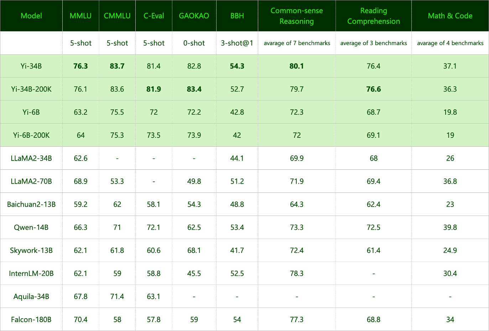

<div align="center">

<picture>
  <source media="(prefers-color-scheme: dark)" srcset="https://raw.githubusercontent.com/01-ai/Yi/main/assets/img/Yi_logo_icon_dark.svg" width="200px">
  <source media="(prefers-color-scheme: light)" srcset="https://raw.githubusercontent.com/01-ai/Yi/main/assets/img/Yi_logo_icon_light.svg" width="200px"> 
  
</picture>

</br>
</br>

<a href="https://github.com/01-ai/Yi/actions/workflows/build_docker_image.yml">
  
</a>
<a href="https://github.com/01-ai/Yi/blob/main/LICENSE">
  
</a>
<a href="https://github.com/01-ai/Yi/blob/main/MODEL_LICENSE_AGREEMENT.txt">
  
</a>
<a href="mailto:oss@01.ai">
  
</a>

</div>

<div align="center">
  <h3 align="center">Building the Next Generation of Open-Source and Bilingual LLMs</h3>
</div>

<p align="center">
🤗 <a href="https://huggingface.co/01-ai" target="_blank">Hugging Face</a> • 🤖 <a href="https://www.modelscope.cn/organization/01ai/" target="_blank">ModelScope</a> • ✡️ <a href="https://wisemodel.cn/organization/01.AI" target="_blank">WiseModel</a>
</p> 

<p align="center">
    👩‍🚀 Ask questions or discuss ideas on <a href="https://github.com/01-ai/Yi/discussions" target="_blank"> GitHub </a>!
</p> 

<p align="center">
    👋 Join us on 💬 <a href="https://github.com/01-ai/Yi/issues/43#issuecomment-1827285245" target="_blank"> WeChat (Chinese) </a>!
</p> 

<p align="center">
    📚 Grow at <a href="#learning-hub">Yi Learning Hub</a>!
</p>
<hr>

<ul>
  <li>🙌 本文由 Yi 和志愿者共同翻译完成，感谢每一位传递知识的火炬手。</li>

  <li>🤗 欢迎大家 <a href="https://github.com/01-ai/Yi/discussions/314">加入我们</a>，开启知识之火旅程，共绘技术内容图谱。</li>
  
  <li>📝 本文翻译使用了 <a href="https://huggingface.co/spaces/01-ai/Yi-34B-Chat">Yi-34B-Chat</a>，关于翻译时使用的 prompt 及最佳实践，参阅 <a href="https://github.com/01-ai/Yi/wiki/%E7%BF%BB%E8%AF%91%E4%B8%8E%E5%AE%A1%E6%A0%A1%E7%9A%84%E6%AD%A3%E7%A1%AE%E5%A7%BF%E5%8A%BF">「翻译与审校的正确姿势」</a>。</li>
</ul>


<!-- DO NOT REMOVE ME -->

<hr>

<details open>
<summary></b>📕 目录</b></summary>


- [🟢 Yi 是什么?](#-yi是什么)
  - [📌 介绍](#-介绍)
  - [🎯 模型](#-models)
    - [聊天模型](#聊天模型)
    - [基座模型](#基座模型)
    - [其他信息](#其他信息)
  - [🎉 最新动态](#-最新动态)
- [🟢 How to use Yi?](#-how-to-use-yi)
  - [快速上手](#quick-start)
    - [选择你的学习路径](#choose-your-path)
    - [快速上手 - 使用 PyPi（pip install）](#pip)
    - [快速上手 - 使用 llama.cpp 量化运行](#llamacpp-快速入门)
    - [快速上手 - 使用 Web Demo](#网页版演示应用web-demo)
    - [快速上手 - 使用 Docker](#快速上手---lm-studio)
    - [快速上手 - 使用 LM Studio](#LM-Studio)
  - [Fine tune](#fine-tune)
  - [Quantization](#quantization)
  - [部署](#部署)
  - [学习中心](#学习中心)
- [🟢 为什么选择Yi？](#-为什么选择Yi?)
  - [🌎 生态系统](#-生态系统)
    - [💦 上游](#-上游)
    - [🌊 下游](#-下游)
      - [🔗 服务](#-服务)
      - [⚙️ 量化](#️-量化)
      - [🛠️ 微调](#️-微调)
      - [API](#api)
  - [📌 Benchmarks](#-benchmarks)
    - [📊 Base model performance](#-base-model-performance)
    - [📊 Chat model performance](#-chat-model-performance)
- [🟢 Who can use Yi?](#-who-can-use-yi)
- [🟢 Misc.](#-misc)
  - [Ackknowledgements](#acknowledgments)
  - [📡 Disclaimer](#-disclaimer)
  - [🪪 License](#-license)

</details>

<hr>

# 🟢 Yi 是什么?

## 📌 介绍

- 🤖 Yi 系列模型是 [01.AI](https://01.ai/) 从零训练的新一代开源大语言模型。

- 🙌 Yi 系列模型是一个双语语言模型，在 3T 多语言语料库上训练而成，是全球最强大的大型语言模型之一。本系列模型在语言认知、常识推理、阅读理解等方面展现出巨大的潜力。例如，

  - 英语语言能力方面，Yi系列模型在2023年12月的 [AlpacaEval Leaderboard](https://tatsu-lab.github.io/alpaca_eval/)排行榜上排名第二（仅次于GPT-4），超过了其他大语言模型（LLM），如 LLaMA2-chat-70B、Claude 2 和 ChatGPT。

  - 中文语言能力方面，Yi系列模型在2023年10月的 [SuperCLUE](https://www.superclueai.com/)排行榜上排名第二（仅次于GPT-4），超过了其他大语言模型，如百度ERNIE、Qwen 和 Baichuan。
  - 🙏 （感谢 LLaMA ）感谢 Transformer 和 LLaMA 开源社区，简化了 [01.AI](https://01.ai/) 从零开始构建大模型的工作，[01.AI](https://01.ai/) 也能够在人工智能生态系统中使用相同的工具。

  <details style="display: inline;"><summary> 如果你对 Yi 采用LLaMA架构及其许可使用政策感兴趣，请参阅 <span style="color:  green;"> Yi 与 LLaMA 的关系</span> ⬇️</summary> <ul> <br>

> 💡 简短总结
> 
> Yi系列模型采用模型架构与LLaMA相同，但它们**不是**LLaMA的衍生品。


- Yi和LLaMA都是基于Transformer结构构建的。实际上，自2018年以来，Transformer一直是大语言模型的常用架构。

- 在Transformer架构的基础上，LLaMA凭借出色的稳定性、可靠的收敛性和强大的兼容性，成为大多数先进开源模型的基石。因此，LLaMA也成为Yi等模型的基础框架。

- 得益于Transformer和LLaMA架构，其他模型可以简化从零开始构建模型的工作，并能够在各自的生态系统中使用相同的工具。

- 然而，Yi系列模型不是LLaMA的衍生品，因为它们不使用LLaMA的权重。

  - 虽然大多数开源模型都采用了LLaMA的结构，但决定模型表现的关键因素是训练所使用的数据集、流水线及其基础设施。

  - [01.AI](https://01.ai/) 用独特的方式开发了Yi，从零开始独立创建了自己的高质量训练数据集、高效的训练流水线和强大的训练基础设施，因此Yi系列模型在性能上取得了卓越的成绩，在2023年12月的[Alpaca Leaderboard](https://tatsu-lab.github.io/alpaca_eval/)上排名仅次于GPT4，超过了LLaMA。
</ul>
</details>

<div align="right"> [ <a href="#building-the-next-generation-of-open-source-and-bilingual-llms">回到顶部 ⬆️ </a> ] </div>

## 🎉 最新动态

<details open>
  <summary>🎯 <b>2024年01月23日</b>: <code><a href="https://huggingface.co/01-ai/Yi-VL-34B">Yi-VL-34B</a></code> 和 <code><a href="https://huggingface.co/01-ai/Yi-VL-6B">Yi-VL-6B</a></code>的多模态语言大模型，均已开源并对公众开放。</summary>
  <br>
   在<a href="https://arxiv.org/abs/2311.16502">MMMU</a> 和 <a href="https://arxiv.org/abs/2401.11944">CMMMU</a>最新的基准测试中（截至2024年1月的可用数据），<code><a href="https://huggingface.co/01-ai/Yi-VL-34B">Yi-VL-34B</a></code>荣登榜首。</li>
</details>

<details>
<summary>🎯 <b>2023/11/23</b>: 六大聊天模型均已开源并对公众开放。</summary>
<br>
发布了两个聊天模型，都是基于之前发布的两个基座模型；也发布了由 GPTQ 量化的两个8位模型和由 AWQ 量化的两个4位模型。

- `Yi-34B-Chat`
- `Yi-34B-Chat-4bits`
- `Yi-34B-Chat-8bits`
- `Yi-6B-Chat`
- `Yi-6B-Chat-4bits`
- `Yi-6B-Chat-8bits`

你可以访问以下链接进行试用：

- [Hugging Face](https://huggingface.co/spaces/01-ai/Yi-34B-Chat)
- [Replicate](https://replicate.com/01-ai)
</details>

<details>
<summary>🔔 <b>2023/11/23</b>: Yi系列模型社区许可协议更新至 v2.1 版本。</summary>
</details>

<details> 
<summary>🔥 <b>2023/11/08</b>: Yi-34B 聊天模型开始邀请测试。</summary>
<br>
参与测试申请表：

- [英文](https://cn.mikecrm.com/l91ODJf)
- [中文](https://cn.mikecrm.com/gnEZjiQ)

</details>

<details>
<summary>🎯 <b>2023/11/05</b>: <code>Yi-6B-200K</code> 和 <code>Yi-34B-200K</code> 的基座模型均已开源并对公众开放。 </summary>
<br>
发布了两个与之前发布参数规模相同的基座模型，只是上下文窗口扩展到了200K。

</details>

<details>
<summary>🎯 <b>2023/11/02</b>: <code>Yi-6B</code> 和 <code>Yi-34B</code> 的基座模型均已开源并对公众开放。</summary>
<br>
首次公开发布了两个双语（英语/中文）基座模型，参数规模分别为6B和34B。两者均以4K序列长度进行训练，并在推理时可扩展到32K。

</details>

<div align="right"> [ <a href="#building-the-next-generation-of-open-source-and-bilingual-llms">回到顶部 ⬆️ </a> ] </div>

## 🎯 模型
Yi模型有多种参数规模，适用于不同的使用场景。你也可以对Yi模型进行微调，从而满足特定需求。

如果你想要部署Yi模型，请确保您的软件和硬件满足[部署要求](#deployment).

### 聊天模型

| 模型 | 下载 
|---|---
Yi-34B-Chat	| • [🤗 Hugging Face](https://huggingface.co/01-ai/Yi-34B-Chat)  • [🤖 ModelScope](https://www.modelscope.cn/models/01ai/Yi-34B-Chat/summary)
Yi-34B-Chat-4bits	| • [🤗 Hugging Face](https://huggingface.co/01-ai/Yi-34B-Chat-4bits)  • [🤖 ModelScope](https://www.modelscope.cn/models/01ai/Yi-34B-Chat-4bits/summary)
Yi-34B-Chat-8bits | • [🤗 Hugging Face](https://huggingface.co/01-ai/Yi-34B-Chat-8bits) • [🤖 ModelScope](https://www.modelscope.cn/models/01ai/Yi-34B-Chat-8bits/summary)
Yi-6B-Chat| • [🤗 Hugging Face](https://huggingface.co/01-ai/Yi-6B-Chat) • [🤖 ModelScope](https://www.modelscope.cn/models/01ai/Yi-6B-Chat/summary)
Yi-6B-Chat-4bits |	• [🤗 Hugging Face](https://huggingface.co/01-ai/Yi-6B-Chat-4bits)  • [🤖 ModelScope](https://www.modelscope.cn/models/01ai/Yi-6B-Chat-4bits/summary)
Yi-6B-Chat-8bits	|  • [🤗 Hugging Face](https://huggingface.co/01-ai/Yi-6B-Chat-8bits) • [🤖 ModelScope](https://www.modelscope.cn/models/01ai/Yi-6B-Chat-8bits/summary)

<sub><sup> - 4-bit系列模型由AWQ量化。<br> - 8-bit系列模型由GPTQ量化。<br> - 所有量化模型都具有较低的使用门槛，因此它们可以在消费级GPU（例如3090、4090）上部署。</sup></sub>
### 基座模型

| 模型 | 下载 | 
|---|---|
Yi-34B| • [🤗 Hugging Face](https://huggingface.co/01-ai/Yi-34B)  • [🤖 ModelScope](https://www.modelscope.cn/models/01ai/Yi-34B/summary)
Yi-34B-200K|• [🤗 Hugging Face](https://huggingface.co/01-ai/Yi-34B-200K)  • [🤖 ModelScope](https://www.modelscope.cn/models/01ai/Yi-34B-200K/summary)
Yi-6B| • [🤗 Hugging Face](https://huggingface.co/01-ai/Yi-6B)  • [🤖 ModelScope](https://www.modelscope.cn/models/01ai/Yi-6B/summary)
Yi-6B-200K	| • [🤗 Hugging Face](https://huggingface.co/01-ai/Yi-6B-200K) • [🤖 ModelScope](https://www.modelscope.cn/models/01ai/Yi-6B-200K/summary)

<sub><sup> - 200k 大约相当于 40 万个汉字。</sup></sub>

### 其他信息

- 聊天和基座模型：

  - 6B 系列的模型适合个人和学术使用。

  - 34B 系列的模型适合个人、学术和商业用途（特别是对于中小型企业）。这是一个性价比高的解决方案，价格合理，能力超出预期。

  - **默认的上下文窗口**是 **4k tokens**。

  - 预训练的 tokens 数量是 3T。

  - 训练数据截至 2023 年 6 月。

- 聊天模型
  
  <details style="display: inline;"><summary>关于聊天模型的局限性，见以下解释。 ⬇️</summary> 
   <ul>
   <br> <a href="https://01.ai/">01.AI</a> 发布的聊天模型在独家训练中采用了监督微调（SFT）技术。与其他标准聊天模型相比， <a href="https://01.ai/">01.AI</a> 的模型生成的回复更加多样化，因此适用于各种下游任务，比如创意场景。此外，回复更加多样化，有利于提高回复的质量，对后续的强化学习（RL）训练帮助很大。

    <br>需要注意的是，回复多样化也可能会导致某些已知问题更加严重，包括：
      <li>虚构：即模型可能会生成事实错误或不连贯的信息。模型回复多样化，更有可能出现虚构的现象，这些虚构的回复可能不是基于准确的数据或逻辑推理。</li>
      <li>重新生成的回复不一致：重新生成回复或者对回复进行采样时，结果可能出现前后不一致。多样性增多会导致即使在相似的输入条件下，结果也会存在差异。</li>
      <li>累积误差：当模型回复的错误随时间累积，就会出现累计误差的现象。模型回复的多样化增加了小误差积累成大错误的可能性，这种情况常见于扩展推理、解决数学问题等复杂任务中等。</li>
      <li>为了获得更连贯一致的回答，建议调整生成配置参数，如温度、top_p 或 top_k。这些调整有利于平衡模型回复的创造性和连贯性。</li>
</ul>
</details>

<div align="right"> [ <a href="#building-the-next-generation-of-open-source-and-bilingual-llms">回到顶部 ⬆️ </a> ] </div>


# 🟢 How to use Yi?

- [Quick start](#quick-start)
  - [Choose your path](#choose-your-parth)
  - [pip](#pip)
  - [llama.cpp](https://github.com/01-ai/Yi/blob/main/docs/yi_llama.cpp.md)
  - [快速上手 - 使用 LM Studio](#快速上手---lm-studio)
  - [Web demo](#web-demo)
- [Fine tune](#fine-tune)
- [Quantization](#quantization)
- [Deployment](https://github.com/01-ai/Yi/blob/main/docs/deployment.md)
- [Learning hub](https://github.com/01-ai/Yi/blob/main/docs/learning_hub.md)

## Quick start

Getting up and running with Yi models is simple with multiple choices available. 

### Choose your path

Select one of the following paths to begin your journey with Yi!

 

#### 🎯 Deploy Yi locally

If you prefer to deploy Yi models locally, 

  - 🙋‍♀️ and you have **sufficient** resources (for example, NVIDIA A800 80GB), you can choose one of the following methods:
    - [pip](#pip)
    - [Docker](https://github.com/01-ai/Yi/blob/main/docs/README_legacy_cn.md#11-docker)
    - [conda-lock](https://github.com/01-ai/Yi/blob/main/docs/README_legacy.md#12-local-development-environment)

  - 🙋‍♀️ and you have **limited** resources (for example, a MacBook Pro), you can use [llama.cpp](#quick-start---llamacpp)

#### 🎯 Not to deploy Yi locally

If you prefer not to deploy Yi models locally, you can explore Yi's capabilities using any of the following options.

##### 🙋‍♀️ Run Yi with APIs

If you want to explore more features of Yi, you can adopt one of these methods:

- Yi APIs (Yi official)
  - [Early access has been granted](https://x.com/01AI_Yi/status/1735728934560600536?s=20) to some applicants. Stay tuned for the next round of access!

- [Yi APIs](https://replicate.com/01-ai/yi-34b-chat/api?tab=nodejs) (Replicate)

##### 🙋‍♀️ Run Yi in playground

If you want to chat with Yi with more customizable options (e.g., system prompt, temperature, repetition penalty, etc.), you can try one of the following options:
  
  - [Yi-34B-Chat-Playground](https://platform.lingyiwanwu.com/prompt/playground) (Yi official)
    - Access is available through a whitelist. Welcome to apply (fill out a form in [English](https://cn.mikecrm.com/l91ODJf) or [Chinese](https://cn.mikecrm.com/gnEZjiQ)).
  
  - [Yi-34B-Chat-Playground](https://replicate.com/01-ai/yi-34b-chat) (Replicate) 

##### 🙋‍♀️ Chat with Yi

 If you want to chat with Yi, you can use one of these online services, which offer a similar user experience:

- [Yi-34B-Chat](https://huggingface.co/spaces/01-ai/Yi-34B-Chat) (Yi official on Hugging Face)
  - No registration is required.

- [Yi-34B-Chat](https://platform.lingyiwanwu.com/) (Yi official beta)
  - Access is available through a whitelist. Welcome to apply (fill out a form in [English](https://cn.mikecrm.com/l91ODJf) or [Chinese](https://cn.mikecrm.com/gnEZjiQ)).

### Quick start - pip

This tutorial guides you through every step of running **Yi-34B-Chat locally on an A800 (80G)** and then performing inference.

#### Step 0: Prerequistes
 
- Make sure Python 3.10 or a later version is installed.

- If you want to run other Yi models, see [software and hardware requirements](#deployment)

#### Step 1: Prepare your environment 

To set up the environment and install the required packages, execute the following command.

```bash
git clone https://github.com/01-ai/Yi.git
cd yi
pip install -r requirements.txt
```

#### Step 2: Download the Yi model

You can download the weights and tokenizer of Yi models from the following sources:

- [Hugging Face](https://huggingface.co/01-ai)
- [ModelScope](https://www.modelscope.cn/organization/01ai/)
- [WiseModel](https://wisemodel.cn/organization/01.AI)

#### Step 3: Perform inference

You can perform inference with Yi chat or base models as below.

##### Perform inference with Yi chat model

1. Create a file named  `quick_start.py` and copy the following content to it.

    ```python
    from transformers import AutoModelForCausalLM, AutoTokenizer

    model_path = '<your-model-path>'

    tokenizer = AutoTokenizer.from_pretrained(model_path, use_fast=False)

    # Since transformers 4.35.0, the GPT-Q/AWQ model can be loaded using AutoModelForCausalLM.
    model = AutoModelForCausalLM.from_pretrained(
        model_path,
        device_map="auto",
        torch_dtype='auto'
    ).eval()

    # Prompt content: "hi"
    messages = [
        {"role": "user", "content": "hi"}
    ]

    input_ids = tokenizer.apply_chat_template(conversation=messages, tokenize=True, add_generation_prompt=True, return_tensors='pt')
    output_ids = model.generate(input_ids.to('cuda'))
    response = tokenizer.decode(output_ids[0][input_ids.shape[1]:], skip_special_tokens=True)

    # Model response: "Hello! How can I assist you today?"
    print(response)
    ```

2. Run `quick_start.py`.

    ```bash
    python quick_start.py
    ```

    Then you can see an output similar to the one below. 🥳

    ```bash
    Hello! How can I assist you today?
    ```

##### Perform inference with Yi base model

The steps are similar to [pip - Perform inference with Yi chat model](#perform-inference-with-yi-chat-model).

You can use the existing file [`text_generation.py`](https://github.com/01-ai/Yi/tree/main/demo).

```bash
python demo/text_generation.py  --model <your-model-path>
```

Then you can see an output similar to the one below. 🥳

<details>

<summary>Output ⬇️ </summary>

<br>

**Prompt**: Let me tell you an interesting story about cat Tom and mouse Jerry,

**Generation**: Let me tell you an interesting story about cat Tom and mouse Jerry, which happened in my childhood. My father had a big house with two cats living inside it to kill mice. One day when I was playing at home alone, I found one of the tomcats lying on his back near our kitchen door, looking very much like he wanted something from us but couldn’t get up because there were too many people around him! He kept trying for several minutes before finally giving up...

</details>

### 快速上手 - Docker

<details>
<summary> 🚀 以下是如何在本地运行 Yi-34B-Chat 模型的详细教程 👇</summary>
<br>这个教程将指导你如何在本地 A800 GPU 上运行 <strong>Yi-34B-Chat</strong> 模型，并执行推理。
<h4>步骤0: 准备工作</h4>
<p>确保你已经安装了 <a href="https://docs.docker.com/engine/install/?open_in_browser=true">Docker</a> 和 <a href="https://docs.nvidia.com/datacenter/cloud-native/container-toolkit/latest/install-guide.html">nvidia-container-toolkit</a>。</p>
<h4>步骤1: 启动 Docker 容器</h4>
<pre><code>docker run -it --gpus all \
-v &lt;your-model-path&gt;: /models
ghcr.io/01-ai/yi:latest
</code></pre>
<p>或者，你也可以从<code>registry.lingyiwanwu.com/ci/01-ai/yi:latest</code> 拉取已经构建好的 Yi Docker 镜像。</p>

<h4>步骤2: 执行推理</h4>
    <p>你可以使用Yi 的聊天模型或基础模型来执行推理。</p>
    
<h5>使用 Yi 聊天模型执行推理</h5>
    <p>执行推理的步骤与使用<a href="#perform-inference-with-yi-chat-model">pip安装指南</a>类似。</p>
    <p><strong>请注意</strong> 唯一不同的是你需要设置 <code>model_path = '&lt;your-model-mount-path&gt;'</code> 而不是 <code>model_path = '&lt;your-model-path&gt;'</code>。</p>
<h5>使用 Yi 基础模型执行推理</h5>
    <p>执行推理的步骤与使用<a href="#perform-inference-with-yi-chat-model">pip安装指南</a>类似。</p>
    <p><strong>请注意</strong> 唯一不同的是你需要设置 <code>--model &lt;your-model-mount-path&gt;'</code> 而不是 <code>model &lt;your-model-path&gt;</code>。</p>
</details>


### 快速上手 - llama.cpp
<details>
<summary> 🚀 以下是使用 llama.cpp 在本地运行 Yi-chat-6B-2bits 模型的详细教程👇 </summary> 
<br>该教程分享如何在本地运行 <a href="https://huggingface.co/XeIaso/yi-chat-6B-GGUF/tree/main">Yi-chat-6B-2bits</a> 量化模型，并且进行推理。</p>

- [步骤 0: 前提条件](#step-0-prerequisites)
- [步骤 1: 下载 llama.cpp](#step-1-download-llamacpp)
- [步骤 2: 下载 Yi 模型](#step-2-download-yi-model)
- [步骤 3: 进行推理](#step-3-perform-inference)

#### 步骤 0: 前提条件

- 该教程在 MacBook Pro（16GB 内存和 Apple M2 Pro 芯片）上运行 。

- 确保你的电脑上安装了 [`git-lfs`](https://git-lfs.com/) 。
  
#### 步骤 1: 下载 `llama.cpp`

克隆 [`llama.cpp`](https://github.com/ggerganov/llama.cpp) 仓库，请运行以下命令：

```bash
git clone git@github.com:ggerganov/llama.cpp.git
```

#### 步骤 2: 下载 Yi 模型

步骤 2.1：仅下载 [XeIaso/yi-chat-6B-GGUF](https://huggingface.co/XeIaso/yi-chat-6B-GGUF/tree/main) 仓库的 pointers，运行以下命令。

```bash
GIT_LFS_SKIP_SMUDGE=1 git clone https://huggingface.co/XeIaso/yi-chat-6B-GGUF
```

步骤 2.2：下载量化后的 Yi 模型 [yi-chat-6b.Q2_K.gguf](https://huggingface.co/XeIaso/yi-chat-6B-GGUF/blob/main/yi-chat-6b.Q2_K.gguf)，运行以下命令：

```bash
git-lfs pull --include yi-chat-6b.Q2_K.gguf
```

#### 步骤 3: 执行推理

如需体验 Yi 模型（进行模型推理），你可以选择以下任意一种方法。

- [方法 1：在终端中执行推理](#method-1-perform-inference-in-terminal)
  
- [方法 2：在网页上执行推理](#method-2-perform-inference-in-web)

### 方法一：在终端中执行推理

本文使用 4 个线程编译 `llama.cpp` ，之后进行推理。在 `llama.cpp` 所在的目录，运行以下命令。

> ### 提示
>
> - 将 `/Users/yu/yi-chat-6B-GGUF/yi-chat-6b.Q2_K.gguf` 替换为你的模型的实际路径。
>
> - 默认情况下，模型是续写模式。
> - 如需查看更多自定义选项（例如，系统提示、温度、重复惩罚等），运行 `./main -h` 查看详细使用说明。

```bash
make -j4 && ./main -m /Users/yu/yi-chat-6B-GGUF/yi-chat-6b.Q2_K.gguf -p "How do you feed your pet fox? Please answer this question in 6 simple steps:\nStep 1:" -n 384 -e

...

How do you feed your pet fox? Please answer this question in 6 simple steps:

Step 1: Select the appropriate food for your pet fox. You should choose high-quality, balanced prey items that are suitable for their unique dietary needs. These could include live or frozen mice, rats, pigeons, or other small mammals, as well as fresh fruits and vegetables.

Step 2: Feed your pet fox once or twice a day, depending on the species and its individual preferences. Always ensure that they have access to fresh water throughout the day.

Step 3: Provide an appropriate environment for your pet fox. Ensure it has a comfortable place to rest, plenty of space to move around, and opportunities to play and exercise.

Step 4: Socialize your pet with other animals if possible. Interactions with other creatures can help them develop social skills and prevent boredom or stress.

Step 5: Regularly check for signs of illness or discomfort in your fox. Be prepared to provide veterinary care as needed, especially for common issues such as parasites, dental health problems, or infections.

Step 6: Educate yourself about the needs of your pet fox and be aware of any potential risks or concerns that could affect their well-being. Regularly consult with a veterinarian to ensure you are providing the best care.

...

```

恭喜你！你已经成功地向 Yi 模型提出了问题并得到了回答！🥳

### 方法二：在网页上进行推理

1. 初始化一个轻量级、快速的聊天机器人，运行以下命令。

    ```bash
    ./server --ctx-size 2048 --host 0.0.0.0 --n-gpu-layers 64 --model /Users/yu/yi-chat-6B-GGUF/yi-chat-6b.Q2_K.gguf
    ```

    你将会看到类似的输出：

    ```bash
    ...

    llama_new_context_with_model: n_ctx      = 2048
    llama_new_context_with_model: freq_base  = 5000000.0
    llama_new_context_with_model: freq_scale = 1
    ggml_metal_init: allocating
    ggml_metal_init: found device: Apple M2 Pro
    ggml_metal_init: picking default device: Apple M2 Pro
    ggml_metal_init: ggml.metallib not found, loading from source
    ggml_metal_init: GGML_METAL_PATH_RESOURCES = nil
    ggml_metal_init: loading '/Users/yu/llama.cpp/ggml-metal.metal'
    ggml_metal_init: GPU name:   Apple M2 Pro
    ggml_metal_init: GPU family: MTLGPUFamilyApple8 (1008)
    ggml_metal_init: hasUnifiedMemory              = true
    ggml_metal_init: recommendedMaxWorkingSetSize  = 11453.25 MB
    ggml_metal_init: maxTransferRate               = built-in GPU
    ggml_backend_metal_buffer_type_alloc_buffer: allocated buffer, size =   128.00 MiB, ( 2629.44 / 10922.67)
    llama_new_context_with_model: KV self size  =  128.00 MiB, K (f16):   64.00 MiB, V (f16):   64.00 MiB
    ggml_backend_metal_buffer_type_alloc_buffer: allocated buffer, size =     0.02 MiB, ( 2629.45 / 10922.67)
    llama_build_graph: non-view tensors processed: 676/676
    llama_new_context_with_model: compute buffer total size = 159.19 MiB
    ggml_backend_metal_buffer_type_alloc_buffer: allocated buffer, size =   156.02 MiB, ( 2785.45 / 10922.67)
    Available slots:
    -> Slot 0 - max context: 2048

    llama server listening at http://0.0.0.0:8080
    ```

2. 访问聊天机器人界面，打开你的网络浏览器，在地址栏中输入 `http://0.0.0.0:8080`。

    

3. 在提示窗口中输入一个问题，例如，“如何喂养你的宠物狐狸？请用 6 个简单的步骤回答”，你将会收到一个答案。

    

</ul>
</details>

### 快速上手 - Web Demo

你可以使用 Yi **聊天模型**（Yi-34B-Chat）打造一个 Web Demo。注意：Yi 基础模型（Yi-34B）不支持该功能。

[第一步：准备环境](#step-1-prepare-your-environment)

[第二步：下载模型](#step-2-download-the-yi-model)

第三步：启动网页服务，运行以下命令。

```bash
python demo/web_demo.py -c <你的模型路径>
```

命令运行完毕后，你可以在浏览器中输入控制台提供的网址，来使用 Web Demo。

 

### 快速上手-LM-Studio
<details>
  <summary>AI专业术语📚字全都认识但就是看不懂🤔? 模型部署运行后bug🐛不断? docker命令行操作实在是太反人类😩? 如果你正在为上述问题发愁😰, LM Studio将会是你最好的选择✨🚀.</summary>

  #### 步骤1：下载与安装
  前往[LM Studio官网](https://lmstudio.ai)下载适合您操作系统的LM Studio版本，并完成安装。
  
  #### 步骤2：模型选择与下载
  启动LM Studio后，在软件内部搜索Yi系列模型,并根据模型系统兼容性推荐下载。
  
  #### 步骤3：配置模型参数
  按照LM Studio的提示配置模型参数，确保硬件设置与您的系统资源相匹配。
  
  #### 步骤4：启动模型
  完成配置后，您就可以在本地启动Yi模型，并开始使用。
  
  LM Studio同时还提供方便快捷的兼容OpenAI接口的工具.对于个人日常应用,部署Yi来进行聊天或配置服务器，LM Studio将会是你很好的起点✨🚀。
</details>

### Finetuning

```bash
bash finetune/scripts/run_sft_Yi_6b.sh
```

Once finished, you can compare the finetuned model and the base model with the following command:

```bash
bash finetune/scripts/run_eval.sh
```
<details style="display: inline;"><summary>For advanced usage (like fine-tuning based on your custom data), see ⬇️</summary> <ul>

### Finetune code for Yi 6B and 34B

#### Preparation

##### From Image

By default, we use a small dataset from [BAAI/COIG](https://huggingface.co/datasets/BAAI/COIG) to finetune the base model.
You can also prepare your customized dataset in the following `jsonl` format:

```json
{ "prompt": "Human: Who are you? Assistant:", "chosen": "I'm Yi." }
```

And then mount them in the container to replace the default ones:

```bash
docker run -it \
    -v /path/to/save/finetuned/model/:/finetuned-model \
    -v /path/to/train.jsonl:/yi/finetune/data/train.json \
    -v /path/to/eval.jsonl:/yi/finetune/data/eval.json \
    ghcr.io/01-ai/yi:latest \
    bash finetune/scripts/run_sft_Yi_6b.sh
```

##### From Local Server

Make sure you have conda. If not, use

```bash
mkdir -p ~/miniconda3
wget https://repo.anaconda.com/miniconda/Miniconda3-latest-Linux-x86_64.sh -O ~/miniconda3/miniconda.sh
bash ~/miniconda3/miniconda.sh -b -u -p ~/miniconda3
rm -rf ~/miniconda3/miniconda.sh
~/miniconda3/bin/conda init bash
source ~/.bashrc
```

Then, create a conda env:

```bash
conda create -n dev_env python=3.10 -y
conda activate dev_env
pip install torch==2.0.1 deepspeed==0.10 tensorboard transformers datasets sentencepiece accelerate ray==2.7
```

#### Hardware Setup

For the Yi-6B model, a node with 4 GPUs, each has GPU mem larger than 60GB is recommended.

For the Yi-34B model, because the usage of zero-offload technique takes a lot CPU memory, please be careful to limit the GPU numbers in 34B finetune training. Please use CUDA_VISIBLE_DEVICES to limit the GPU number (as shown in scripts/run_sft_Yi_34b.sh).

A typical hardware setup for finetuning 34B model is a node with 8GPUS (limit to 4 in running by CUDA_VISIBLE_DEVICES=0,1,2,3), each has GPU mem larger than 80GB, with total CPU mem larger than 900GB.

#### Quick Start

Download a LLM-base model to MODEL_PATH (6B and 34B). A typical folder of models is like:

```bash
|-- $MODEL_PATH
|   |-- config.json
|   |-- pytorch_model-00001-of-00002.bin
|   |-- pytorch_model-00002-of-00002.bin
|   |-- pytorch_model.bin.index.json
|   |-- tokenizer_config.json
|   |-- tokenizer.model
|   |-- ...
```

Download a dataset from huggingface to local storage DATA_PATH, e.g. Dahoas/rm-static.

```bash
|-- $DATA_PATH
|   |-- data
|   |   |-- train-00000-of-00001-2a1df75c6bce91ab.parquet
|   |   |-- test-00000-of-00001-8c7c51afc6d45980.parquet
|   |-- dataset_infos.json
|   |-- README.md
```

`finetune/yi_example_dataset` has example datasets, which are modified from [BAAI/COIG](https://huggingface.co/datasets/BAAI/COIG)

```bash
|-- $DATA_PATH
    |--data
        |-- train.jsonl
        |-- eval.jsonl
```

`cd` into the scripts folder, copy and paste the script, and run. For example:

```bash
cd finetune/scripts

bash run_sft_Yi_6b.sh
```

For the Yi-6B base model, setting training_debug_steps=20 and num_train_epochs=4 can output a chat model, which takes about 20 minutes.

For the Yi-34B base model, it takes a relatively long time for initialization. Please be patient.

#### Evaluation

```bash
cd finetune/scripts

bash run_eval.sh
```

Then you'll see the answer from both the base model and the finetuned model
</ul>
</details>

### Quantization

#### GPT-Q
```bash
python quantization/gptq/quant_autogptq.py \
  --model /base_model                      \
  --output_dir /quantized_model            \
  --trust_remote_code
```

Once finished, you can then evaluate the resulting model as follows:

```bash
python quantization/gptq/eval_quantized_model.py \
  --model /quantized_model                       \
  --trust_remote_code
```

<details style="display: inline;"><summary>For a more detailed explanation, see ⬇️</summary> <ul>

#### GPT-Q quantization

[GPT-Q](https://github.com/IST-DASLab/gptq) is a PTQ(Post-Training Quantization)
method. It's memory saving and provides potential speedups while retaining the accuracy
of the model. 

Yi models can be GPT-Q quantized without a lot of efforts. 
We provide a step-by-step tutorial below.

To run GPT-Q, we will use [AutoGPTQ](https://github.com/PanQiWei/AutoGPTQ) and
[exllama](https://github.com/turboderp/exllama).
And the huggingface transformers has integrated optimum and auto-gptq to perform
GPTQ quantization on language models.

##### Do Quantization

The `quant_autogptq.py` script is provided for you to perform GPT-Q quantization:

```bash
python quant_autogptq.py --model /base_model \
    --output_dir /quantized_model --bits 4 --group_size 128 --trust_remote_code
```


##### Run Quantized Model

You can run a quantized model using the `eval_quantized_model.py`:

```bash
python eval_quantized_model.py --model /quantized_model --trust_remote_code
```
</ul>
</details>

#### AWQ
```bash
python quantization/awq/quant_autoawq.py \
  --model /base_model                      \
  --output_dir /quantized_model            \
  --trust_remote_code
```

Once finished, you can then evaluate the resulting model as follows:

```bash
python quantization/awq/eval_quantized_model.py \
  --model /quantized_model                       \
  --trust_remote_code
```
<details style="display: inline;"><summary>For detailed explanations, see ⬇️</summary> <ul>

#### AWQ quantization

[AWQ](https://github.com/mit-han-lab/llm-awq) is a PTQ(Post-Training Quantization)
method. It's an efficient and accurate low-bit weight quantization (INT3/4) for LLMs.

Yi models can be AWQ quantized without a lot of efforts. 
We provide a step-by-step tutorial below.

To run AWQ, we will use [AutoAWQ](https://github.com/casper-hansen/AutoAWQ).

##### Do Quantization

The `quant_autoawq.py` script is provided for you to perform AWQ quantization:

```bash
python quant_autoawq.py --model /base_model \
    --output_dir /quantized_model --bits 4 --group_size 128 --trust_remote_code
```

##### Run Quantized Model

You can run a quantized model using the `eval_quantized_model.py`:

```bash
python eval_quantized_model.py --model /quantized_model --trust_remote_code
```


</ul>
</details>
<div align="right"> [ <a href="#building-the-next-generation-of-open-source-and-bilingual-llms">Back to top ⬆️ </a> ] </div>

### 部署

如果您想部署Yi模型，请确保满足以下软件和硬件要求。

#### 软件要求

在使用Yi量化模型之前，请确保您已安装以下列出的软件。

| 模型 | 软件 |
|:---|:---|
Yi 4-bit quantized models | [AWQ and CUDA](https://github.com/casper-hansen/AutoAWQ?tab=readme-ov-file#install-from-pypi)
Yi 8-bit quantized models |  [GPTQ and CUDA](https://github.com/PanQiWei/AutoGPTQ?tab=readme-ov-file#quick-installation)

#### 硬件要求

在您的环境中部署Yi之前，请确保您的硬件满足以下要求。

##### 聊天模型

| 模型                 | 最低显存      | 推荐GPU示例                             |
|:----------------------|:--------------|:-------------------------------------:|
| Yi-6B-Chat           | 15 GB         | RTX 3090 <br> RTX 4090 <br>  A10 <br> A30             |
| Yi-6B-Chat-4bits     | 4 GB          | RTX 3060 <br>  RTX 4060                     |
| Yi-6B-Chat-8bits     | 8 GB          | RTX 3070 <br> RTX 4060                     |
| Yi-34B-Chat          | 72 GB         | 4 x RTX 4090 <br> A800 (80GB)               |
| Yi-34B-Chat-4bits    | 20 GB         | RTX 3090  <br> RTX 4090 <br> A10 <br> A30 <br> A100 (40GB) |
| Yi-34B-Chat-8bits    | 38 GB         | 2 x RTX 3090  <br> 2 x RTX 4090 <br> A800  (40GB) |

以下是不同批量使用情况下的详细最低显存要求。

|  模型                  | batch=1 | batch=4 | batch=16 | batch=32 |
| :----------------------- | :------- | :------- | :-------- | :-------- |
| Yi-6B-Chat              | 12 GB   | 13 GB   | 15 GB    | 18 GB    |
| Yi-6B-Chat-4bits  | 4 GB    | 5 GB    | 7 GB     | 10 GB    |
| Yi-6B-Chat-8bits  | 7 GB    | 8 GB    | 10 GB    | 14 GB    |
| Yi-34B-Chat       | 65 GB   | 68 GB   | 76 GB    | > 80 GB   |
| Yi-34B-Chat-4bits | 19 GB   | 20 GB   | 30 GB    | 40 GB    |
| Yi-34B-Chat-8bits | 35 GB   | 37 GB   | 46 GB    | 58 GB    |

##### 基础模型

|模型                   |最低显存      |        推荐GPU示例                     |
|:----------------------|:--------------|:-------------------------------------:|
| Yi-6B                | 15 GB         | RTX3090 <br> RTX4090 <br> A10 <br> A30               |
| Yi-6B-200K           | 50 GB         | A800 (80 GB)                            |
| Yi-34B               | 72 GB         | 4 x RTX 4090 <br> A800 (80 GB)               |
| Yi-34B-200K          | 200 GB        | 4 x A800 (80 GB)                        |

### 学习中心

<details>
<summary> 如果你想学习Yi，你可以在这里找到大量的有用的学习资源 ⬇️</summary>
<br>

欢迎来到Yi学习中心！

无论你是经验丰富的开发者还是新手，你都可以找到大量有用的学习资源，以提高你对Yi模型的理解和技能，包括深入的博客文章、全面的视频教程、实践指南等等。

在这里，你能找到的内容是由知识渊博的Yi专家和热情的爱好者慷慨贡献的。我们对您宝贵的贡献表示衷心的感谢！

同时，我们也热烈邀请您加入我们的协作努力，为Yi做出贡献。如果您已经对Yi做出了贡献，请不要犹豫，在下面的表格中展示您杰出的工作。

有了这些唾手可得的资源，您就准备好开始与Yi的激动人心的Yi学习之旅了。祝学习愉快！🥳

#### 教程


| 类型        | 教程地址                                            |      日期      |     作者     |
|:-------------|:--------------------------------------------------------|:----------------|:----------------|
| 博客        | [本地运行零一万物 34B 大模型，使用 Llama.cpp & 21G 显存](https://zhuanlan.zhihu.com/p/668921042)                  |  2023-11-26  |  [苏洋](https://github.com/soulteary)  |
| 博客        | [Running Yi-34B-Chat locally using LlamaEdge](https://www.secondstate.io/articles/yi-34b/)                   |  2023-11-30  |  [Second State](https://github.com/second-state)  |
| 博客       | [零一万物模型折腾笔记：官方 Yi-34B 模型基础使用](https://zhuanlan.zhihu.com/p/671387298)                           | 2023-12-10 |  [苏洋](https://github.com/soulteary)  |
| 博客        | [CPU 混合推理，非常见大模型量化方案：“二三五六” 位量化方案](https://zhuanlan.zhihu.com/p/671698216)                  | 2023-12-12 |  [苏洋](https://github.com/soulteary)  |
| 视频       | [只需 24G 显存，用 vllm 跑起来 Yi-34B 中英双语大模型](https://www.bilibili.com/video/BV17t4y1f7Ee/)               | 2023-12-28 |  漆妮妮  |
| 视频       | [Install Yi 34B Locally - Chinese English Bilingual LLM](https://www.youtube.com/watch?v=CVQvj4Wrh4w&t=476s) | 2023-11-05  |  Fahd Mirza  |
</details>


# 🟢 为什么选择Yi？

  - [🌎 生态系统](#-生态系统)
    - [💦 上游](#-上游)
    - [🌊 下游](#-下游)
      - [🔗 服务](#-服务)
      - [⚙️ 量化](#️-量化)
      - [🛠️ 微调](#️-微调)
      - [API](#api)
  - [📌 基准测试](#-基准测试)
    - [📊 聊天模型性能](#-聊天模型性能)
    - [📊 基础模型性能](#-基础模型性能)

## 🌎 生态系统

Yi拥有一个全面的生态系统，提供一系列工具、服务和模型，以丰富您的体验并最大化生产力。

- [💦 上游](#-上游)
- [🌊 下游](#-下游)
  - [🔗 服务](#-服务)
  - [⚙️ 量化](#️-量化)
  - [🛠️ 微调](#️-微调)
  - [API](#api)

### 💦 上游

Yi系列模型遵循与LLaMA相同的模型架构。选择Yi，您可以利用LLaMA生态系统中现有的工具、库和资源，无需创建新工具，提高开发效率。

例如，Yi系列模型以LLaMA模型的格式保存。您可以直接使用`LLaMAForCausalLM`和`LLaMATokenizer`加载模型。更多信息，请见[使用聊天模型](#31-使用聊天模型)。

```python
from transformers import AutoModelForCausalLM, AutoTokenizer

tokenizer = AutoTokenizer.from_pretrained("01-ai/Yi-34b", use_fast=False)

model = AutoModelForCausalLM.from_pretrained("01-ai/Yi-34b", device_map="auto")
```

### 🌊 下游

> 💡 提示
> 
> - 随时创建PR并分享您使用Yi系列模型构建的出色作品。
>
> - 为了帮助他人快速理解您的工作，建议使用`<模型名称>: <模型简介> + <模型亮点>`的格式。

#### 🔗 服务

如果您想在几分钟内开始使用Yi，您可以使用以下基于Yi构建的服务。

- Yi-34B-Chat：您可以通过以下平台与Yi进行聊天：
  - [Yi-34B-Chat | Hugging Face](https://huggingface.co/spaces/01-ai/Yi-34B-Chat)
  - [Yi-34B-Chat | Yi Platform](https://platform.lingyiwanwu.com/)：**注意**目前仅通过白名单提供。欢迎申请（填写[英文](https://cn.mikecrm.com/l91ODJf)或[中文](https://cn.mikecrm.com/gnEZjiQ)表格）并亲身体验！

- [Yi-6B-Chat (Replicate)](https://replicate.com/01-ai)：您可以通过设置额外参数和调用APIs，以更多选项使用此模型。

- [ScaleLLM](https://github.com/vectorch-ai/ScaleLLM#supported-models)：您可以使用此服务在本地运行Yi模型，增加灵活性和定制性。

#### ⚙️ 量化

如果您的计算能力有限，您可以使用Yi的量化模型，如下所示。

这些量化模型虽然精度降低，但提供了更高的效率，例如更快的推理速度和更小的RAM使用量。

- [TheBloke/Yi-34B-GPTQ](https://huggingface.co/TheBloke/Yi-34B-GPTQ)
- [TheBloke/Yi-34B-GGUF](https://huggingface.co/TheBloke/Yi-34B-GGUF)
- [TheBloke/Yi-34B-AWQ](https://huggingface.co/TheBloke/Yi-34B-AWQ)

#### 🛠️ 微调

如果您希望探索Yi庞大家族中的多样化能力，您可以深入了解下面的Yi微调模型。

- [TheBloke 模型](https://huggingface.co/TheBloke)：这个网站托管了许多从包括Yi在内的各种大型语言模型（LLMs）派生的微调模型。
  
  这不是Yi的详尽列表，但以下是基于下载量排序的几个例子：
  - [TheBloke/dolphin-2_2-yi-34b-AWQ](https://huggingface.co/TheBloke/dolphin-2_2-yi-34b-AWQ)
  - [TheBloke/Yi-34B-Chat-AWQ](https://huggingface.co/TheBloke/Yi-34B-Chat-AWQ)
  - [TheBloke/Yi-34B-Chat-GPTQ](https://huggingface.co/TheBloke/Yi-34B-Chat-GPTQ)
  
- [SUSTech/SUS-Chat-34B](https://huggingface.co/SUSTech/SUS-Chat-34B)：这个模型在所有70B以下的模型中排名第一，并且超越了体量是其两倍的deepseek-llm-67b-chat。您可以在[开放LLM排行榜](https://huggingface.co/spaces/HuggingFaceH4/open_llm_leaderboard)上查看结果。
  
- [OrionStarAI/OrionStar-Yi-34B-Chat-Llama](https://huggingface.co/OrionStarAI/OrionStar-Yi-34B-Chat-Llama)：这个模型在C-Eval和CMMLU评估中超越了其他模型（如GPT-4, Qwen-14B-Chat, Baichuan2-13B-Chat）, 在[OpenCompass LLM 排行榜](https://opencompass.org.cn/leaderboard-llm)上表现出色。
  
- [NousResearch/Nous-Capybara-34B](https://huggingface.co/NousResearch/Nous-Capybara-34B)：这个模型在Capybara数据集上使用200K上下文长度和3个训练周期进行训练。

#### API

- [amazing-openai-api](https://github.com/soulteary/amazing-openai-api)：这个工具可以将Yi模型API转换成OpenAI API格式。
- [LlamaEdge](https://www.secondstate.io/articles/yi-34b/#create-an-openai-compatible-api-service-for-the-yi-34b-chat-model)：这个工具使用可移植的Wasm（WebAssembly）文件构建了一个与OpenAI兼容的API服务器，用于Yi-34B-Chat，由Rust驱动。

<div align="right"> [ <a href="#building-the-next-generation-of-open-source-and-bilingual-llms">回到顶部 ⬆️ </a> ] </div>

## 📌 Benchmarks 

- [📊 Chat model performance](#-chat-model-performance)
- [📊 Base model performance](#-base-model-performance)

### 📊 Chat model performance

Yi-34B-Chat model demonstrates exceptional performance, ranking first among all existing open-source models in the benchmarks including MMLU, CMMLU, BBH, GSM8k, and more.

 

<details>
<summary> Evaluation methods and challenges ⬇️ </summary>

- **Evaluation methods**: we evaluated various benchmarks using both zero-shot and few-shot methods, except for TruthfulQA.
- **Zero-shot vs. few-shot**: in chat models, the zero-shot approach is more commonly employed.
- **Evaluation strategy**: our evaluation strategy involves generating responses while following instructions explicitly or implicitly (such as using few-shot examples). We then isolate relevant answers from the generated text.
- **Challenges faced**: some models are not well-suited to produce output in the specific format required by instructions in few datasets, which leads to suboptimal results.

<strong>*</strong>: C-Eval results are evaluated on the validation datasets
</details>

### 📊 Base model performance

The Yi-34B and Yi-34B-200K models stand out as the top performers among open-source models, especially excelling in MMLU, CMML, common-sense reasoning, reading comprehension, and more.



<details>
<summary> Evaluation methods ⬇️</summary>

- **Disparity in Results**: while benchmarking open-source models, a disparity has been noted between results from our pipeline and those reported by public sources like OpenCompass.
- **Investigation Findings**: a deeper investigation reveals that variations in prompts, post-processing strategies, and sampling techniques across models may lead to significant outcome differences.
- **Uniform Benchmarking Process**: our methodology aligns with the original benchmarks—consistent prompts and post-processing strategies are used, and greedy decoding is applied during evaluations without any post-processing for the generated content.
- **Efforts to Retrieve Unreported Scores**: for scores that were not reported by the original authors (including scores reported with different settings), we try to get results with our pipeline.
- **Extensive Model Evaluation**: to evaluate the model’s capability extensively, we adopted the methodology outlined in Llama2. Specifically, we included PIQA, SIQA, HellaSwag, WinoGrande, ARC, OBQA, and CSQA to assess common sense reasoning. SquAD, QuAC, and BoolQ were incorporated to evaluate reading comprehension.
- **Special Configurations**: CSQA was exclusively tested using a 7-shot setup, while all other tests were conducted with a 0-shot configuration. Additionally, we introduced GSM8K (8-shot@1), MATH (4-shot@1), HumanEval (0-shot@1), and MBPP (3-shot@1) under the category "Math & Code".
- **Falcon-180B Caveat**: Falcon-180B was not tested on QuAC and OBQA due to technical constraints. Its performance score is an average from other tasks, and considering the generally lower scores of these two tasks, Falcon-180B's capabilities are likely not underestimated.
</details>

# 🟢 Who can use Yi?

Everyone! 🙌 ✅

- The Yi series models are free for personal usage, academic purposes, and commercial use. All usage must adhere to the [Yi Series Models Community License Agreement 2.1](https://github.com/01-ai/Yi/blob/main/MODEL_LICENSE_AGREEMENT.txt)
  
- For free commercial use, you only need to [complete this form](https://www.lingyiwanwu.com/yi-license) to get a Yi Model Commercial License.

<div align="right"> [ <a href="#building-the-next-generation-of-open-source-and-bilingual-llms">Back to top ⬆️ </a> ] </div>

# 🟢 Misc.

### Acknowledgments

A heartfelt thank you to each of you who have made contributions to the Yi community! You have helped Yi not just a project, but a vibrant, growing home for innovation.

<!---
ref https://github.com/ngryman/contributor-faces
npx contributor-faces --exclude "*bot*" --limit 70 --repo "https://github.com/01-ai/Yi"

change the height and width for each of the contributors from 80 to 50 at ref index.js.
--->

[//]: contributor-faces
<a style="display:inline-block;width=50px;height=50px" href="https://github.com/ZhaoFancy"></a>
<a style="display:inline-block;width=50px;height=50px" href="https://github.com/Anonymitaet"></a>
<a style="display:inline-block;width=50px;height=50px" href="https://github.com/findmyway"></a>
<a style="display:inline-block;width=50px;height=50px" href="https://github.com/shiyue-loop"></a>
<a style="display:inline-block;width=50px;height=50px" href="https://github.com/richardllin"></a>
<a style="display:inline-block;width=50px;height=50px" href="https://github.com/jiangchengSilent"></a>
<a style="display:inline-block;width=50px;height=50px" href="https://github.com/loofahcus"></a>
<a style="display:inline-block;width=50px;height=50px" href="https://github.com/Yimi81"></a>
<a style="display:inline-block;width=50px;height=50px" href="https://github.com/ly-nld"></a>
<a style="display:inline-block;width=50px;height=50px" href="https://github.com/WayTooWill"></a>
<a style="display:inline-block;width=50px;height=50px" href="https://github.com/kai01ai"></a>
<a style="display:inline-block;width=50px;height=50px" href="https://github.com/forpanyang"></a>
<a style="display:inline-block;width=50px;height=50px" href="https://github.com/0x1111"></a>
<a style="display:inline-block;width=50px;height=50px" href="https://github.com/angeligareta"></a>
<a style="display:inline-block;width=50px;height=50px" href="https://github.com/xffxff"></a>
<a style="display:inline-block;width=50px;height=50px" href="https://github.com/tpoisonooo"></a>
<a style="display:inline-block;width=50px;height=50px" href="https://github.com/tdolan21"></a>
<a style="display:inline-block;width=50px;height=50px" href="https://github.com/statelesshz"></a>
<a style="display:inline-block;width=50px;height=50px" href="https://github.com/renxiaoyi"></a>
<a style="display:inline-block;width=50px;height=50px" href="https://github.com/markli404"></a>
<a style="display:inline-block;width=50px;height=50px" href="https://github.com/fecet"></a>
<a style="display:inline-block;width=50px;height=50px" href="https://github.com/cArlIcon"></a>
<a style="display:inline-block;width=50px;height=50px" href="https://github.com/alabulei1"></a>
<a style="display:inline-block;width=50px;height=50px" href="https://github.com/eltociear"></a>
<a style="display:inline-block;width=50px;height=50px" href="https://github.com/Gmgge"></a>

[//]: contributor-faces

<div align="right"> [ <a href="#building-the-next-generation-of-open-source-and-bilingual-llms">Back to top ⬆️ </a> ] </div>

### 📡 Disclaimer

We use data compliance checking algorithms during the training process, to
ensure the compliance of the trained model to the best of our ability. Due to
complex data and the diversity of language model usage scenarios, we cannot
guarantee that the model will generate correct, and reasonable output in all
scenarios. Please be aware that there is still a risk of the model producing
problematic outputs. We will not be responsible for any risks and issues
resulting from misuse, misguidance, illegal usage, and related misinformation,
as well as any associated data security concerns.

<div align="right"> [ <a href="#building-the-next-generation-of-open-source-and-bilingual-llms">Back to top ⬆️ </a> ] </div>

### 🪪 License

The source code in this repo is licensed under the [Apache 2.0
license](https://github.com/01-ai/Yi/blob/main/LICENSE). The Yi series models are fully open for academic research and free for commercial use, with automatic permission granted upon application. All usage must adhere to the [Yi Series Models Community License Agreement 2.1](https://github.com/01-ai/Yi/blob/main/MODEL_LICENSE_AGREEMENT.txt).
For free commercial use, you only need to send an email to [get official commercial permission](https://www.lingyiwanwu.com/yi-license).

<div align="right"> [ <a href="#building-the-next-generation-of-open-source-and-bilingual-llms">Back to top ⬆️ </a> ] </div>
